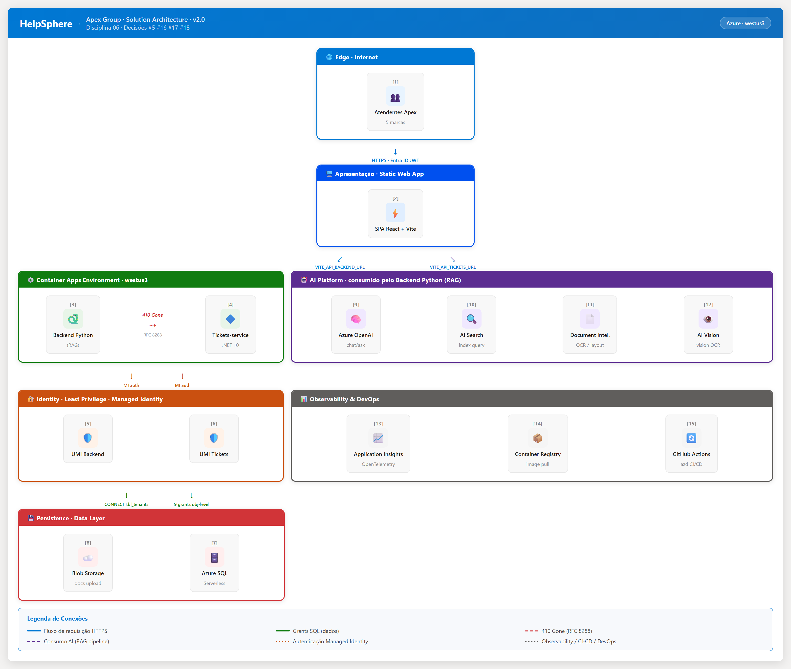

<div align="center">

# apex-rag-lab — Lab Intermediário D06 (fork funcional do `apex-helpsphere` + RAG aplicado)

**Este repositório é o companion do Lab Intermediário (RAG) da Disciplina 06.**
Faça `azd up` daqui — não do `apex-helpsphere` base.

📚 Para o **guia pedagógico do Lab Inter** (entrypoint, gotchas, ordem de execução), abra **[`README-LAB-INTER.md`](./README-LAB-INTER.md)** e **[`PARA-O-ALUNO-LAB-INTER.md`](./PARA-O-ALUNO-LAB-INTER.md)**.

📦 O conteúdo do README abaixo é o do **template base `apex-helpsphere`** (snapshot do commit `98ce579`) com o **plug RAG aplicado por cima** (PR #20 — `RAG_ENABLED` + `<ChatPanel />` + `?chat=1` + endpoint `/chat/rag`). Use como referência técnica do template.

---

# HelpSphere

**Template pedagógico Azure production-grade — multi-tenant ITSM com IA modular.**

Pós-Graduação Avançada de Cloud com Azure · Disciplina 06.

[](https://github.com/tftec-guilherme/apex-helpsphere/actions/workflows/azure-dev-validation.yaml)
[](https://github.com/tftec-guilherme/apex-helpsphere/actions/workflows/dotnet-test.yaml)
[](https://github.com/tftec-guilherme/apex-helpsphere/actions/workflows/frontend.yaml)
[](https://github.com/tftec-guilherme/apex-helpsphere/actions/workflows/python-test.yaml)
[](https://github.com/tftec-guilherme/apex-helpsphere/releases)
[](LICENSE)

</div>

---

## O que é

Plataforma operacional de tickets do **Apex Group** (holding fictícia de varejo, 5 marcas, ~3.500 atendentes, 12k tickets/mês). Você roda `azd up` e ganha **9-14 minutos** para focar no que importa: pipeline RAG, agentes Foundry, automação.

> **Pedagógico, não brinquedo.** Auth two-app Microsoft Entra ID, Managed Identity, RLS-like multi-tenancy, Bicep IaC, observabilidade OpenTelemetry, container deploy. Decisões de arquitetura defendíveis em audiência sênior — documentadas no [`DECISION-LOG.md`](./DECISION-LOG.md) (23 decisões cravadas).

## Quick start (aluno) — local via VSCode

```powershell
# 1. Fork em https://github.com/tftec-guilherme/apex-helpsphere → seu fork
# 2. Clone no VSCode (Ctrl+Shift+P → Git: Clone)
git clone https://github.com/SEU_USUARIO/apex-helpsphere.git
cd apex-helpsphere

# 3. Pre-flight (~30s, 8 validações)
pwsh ./scripts/preflight.ps1   # Windows
./scripts/preflight.sh          # macOS/Linux/WSL

# 4. Login Azure
az login
azd auth login

# 5. Environment azd + flags SaaS-only
azd env new helpsphere-saas-{seu-id}
azd env set DEPLOY_IA_STACK "false"          # IA fica para os labs
azd env set USE_MULTIMODAL "false"
azd env set SKIP_ROLE_ASSIGNMENTS "false"    # sua conta Owner cria roles
azd env set USE_AUTHENTICATION "true"
azd env set USE_SQL_SERVER "true"
azd env set AZURE_LOAD_SEED_DATA "true"
azd env set DEPLOYMENT_TARGET "containerapps"
azd env set AZURE_LOCATION "westus3"

# 6. Deploy completo
azd up                           # ~9-14min
```

📘 **Detalhes completos + 35 surpresas pedagógicas catalogadas:** [`PARA-O-ALUNO.md`](./PARA-O-ALUNO.md)

## Arquitetura



> Diagrama renderizado a partir do HTML interativo `docs/helpsphere_architecture_v2.html` (Apex Executivo brand). Para navegar interativo, abra o HTML no browser.

| Formato | Arquivo | Quando usar |
|---|---|---|
| **HTML interativo (v2 — primário)** | [`docs/helpsphere_architecture_v2.html`](./docs/helpsphere_architecture_v2.html) | Navegação pedagógica em apresentações; clone + abra no browser |
| **PNG 2x retina (renderizado do v2)** | [`docs/architecture.png`](./docs/architecture.png) | Embed em README, slides, docs |
| **Diagrama draw.io editável (v1)** | [`docs/architecture.drawio`](./docs/architecture.drawio) | Edição via [draw.io](https://app.diagrams.net) ou desktop |
| **SVG (v1)** | [`docs/architecture.svg`](./docs/architecture.svg) | Web/scaling |

**7 camadas:** Edge · Apresentação · Container Apps Env · AI Platform · Identity · Observabilidade/DevOps · Persistence.

**Princípios não-negociáveis (v2.1.0):**

- **Local-first via VSCode:** `azd up` com sua conta Azure é o caminho do aluno. CI/CD descontinuado em conta pessoal por ABAC condition (ver `APPENDIX-SURPRESAS.md` #31).
- **Parametrização:** Bicep params + `azd env` (DEPLOY_IA_STACK, SKIP_ROLE_ASSIGNMENTS) — zero hardcode entre subscriptions.
- **SaaS-only base:** IA stack (OpenAI/AI Search/DocIntel/Vision/Speech/Cosmos) NÃO é provisionada aqui — fica para os 3 labs (Inter/Final/Avançado), passo-a-passo Portal Azure.
- **Production-grade pedagogicamente defendível:** sem atalhos de segurança "para o aluno entender mais rápido".

## Stack

| Camada | Tech |
|---|---|
| **Frontend** | React 18 + Vite + TypeScript · Apex Executivo design system (Fraunces + Inter Tight + JetBrains Mono) · Recharts |
| **Backend** | Python 3.13 + Quart (auth, /chat dormente, /tenants/me, /auth_setup runtime config) |
| **Tickets API** | .NET 10 Minimal API + Dapper · Token explicit injection ([Decisão #22](./DECISION-LOG.md)) |
| **IaC** | Azure Bicep (25+ recursos parametrizados) · `azd` v1.23+ |
| **Auth** | Microsoft Entra ID two-app pattern · Directory Extension `app_tenant_id` ([Decisão #19-#21](./DECISION-LOG.md)) |
| **Data** | Azure SQL Serverless (5 tenants seed Apex, 50 tickets pt-BR, 70 comments) |
| **AI Platform** | Azure OpenAI (gpt-4.1-mini · text-embedding-3-large) · AI Search · Document Intelligence · Vision |
| **Compute** | Azure Container Apps + ACR (build remoto via ACR Tasks) |
| **Telemetria** | Application Insights + Log Analytics + dashboard pré-provisionado |

## Estrutura

```
apex-helpsphere/
├── app/
│   ├── backend/                  # Python Quart — auth + /chat (Lab Intermediário ativa) + tenants
│   ├── frontend/                 # React + Vite — Apex Executivo design system
│   ├── tickets-service/          # .NET 10 Minimal API + Dapper — endpoints CRUD + /stats
│   └── functions/                # Azure Functions — RAG cloud ingestion (Lab Avançado)
├── infra/
│   ├── main.bicep                # 6 params expostos · CORS dinâmico · audience v2
│   └── main.parameters.json
├── scripts/
│   ├── preflight.{ps1,sh}        # 8 validações ~30s antes de azd up
│   ├── auth_init.py              # 2 App Registrations + Directory Extension idempotente
│   ├── auth_update.py            # redirect URIs + extension value no user
│   ├── setup_search_index.py     # cria gptkbindex idempotente (postprovision)
│   └── run_prepdocs.{ps1,sh}     # wrapper honrando SKIP_PREPDOCS
├── data/
│   ├── migrations/               # SQL Server schema (idempotente)
│   └── seed/                     # 5 tenants Apex + 50 tickets pt-BR + 70 comments
├── docs/
│   ├── architecture.{drawio,png,svg}
│   ├── helpsphere_architecture_v2.html
│   └── plans/v2.1.0-execution.md
└── .github/workflows/
    ├── azure-dev.yml             # Deploy completo (azd provision + deploy)
    ├── azure-dev-validation.yaml # Bicep validate em PR
    ├── python-test.yaml          # ruff + black + pytest (matrix simplificada v2.1.0)
    ├── frontend.yaml             # prettier + tsc + vite build
    ├── dotnet-test.yaml          # build + xunit
    └── setup-aad.yml             # workflow_dispatch standalone para AAD recreate
```

## Documentação

| Doc | Quando ler |
|---|---|
| [`PARA-O-ALUNO.md`](./PARA-O-ALUNO.md) | Quick start + checklist de pré-requisitos + surpresas pedagógicas catalogadas |
| [`CHANGELOG.md`](./CHANGELOG.md) | Histórico de releases |
| [`SECURITY.md`](./SECURITY.md) | Política de segurança e disclosure |

## Roadmap pedagógico

| Fase | Lab | O que adiciona |
|---|---|---|
| **v2.1.0** (atual) | Setup base | Infra + auth two-app + tickets + dashboard executivo + telemetria |
| Próximo | **Lab Intermediário** (M02-M05) | Pipeline RAG: AI Search index custom + embeddings + chat com citation rendering sobre 62 PDFs Apex |
| Depois | **Lab Final** (M06) | Agentes Foundry com tools + Speech STT/TTS + integração com tickets |
| Sinergia D04 | **Lab Avançado** | Tickets-service publica `TicketStatusChanged` no Service Bus + Logic App reage + dashboard tempo real |

## Contribuir / Reportar bugs

- **Issues:** [GitHub Issues](https://github.com/tftec-guilherme/apex-helpsphere/issues)
- **PRs:** convenção `feat:` / `fix:` / `docs:` / `chore:` + referência a Decisões `#N` quando aplicável (ver `DECISION-LOG.md`)

## License & atribuição

[MIT](./LICENSE) · Forked from [Azure-Samples/azure-search-openai-demo](https://github.com/Azure-Samples/azure-search-openai-demo) (template upstream original — ver `LICENSE.upstream`).

---

<div align="center">

**Prof. Guilherme Campos** · Pós-Graduação Avançada de Cloud com Azure

</div>
