# 📘 Lab Intermediário D06 — Guia Completo Portal Azure

> **Companion público do Lab Intermediário (RAG)** · Disciplina 06: IA e Automação no Azure · Pós-Graduação Arquitetura Cloud Azure · TFTEC + Anhanguera
>
> **Caminho oficial:** este arquivo é a cópia ativa e canônica do guia do Lab Intermediário. Para navegar parte-a-parte, use `docs/parte-01.md` a `docs/parte-09.md`.
>
> **Cross-links úteis:**
> - Snippets copy-paste (scripts Python + JSONs Search): [`../snippets/`](../snippets/)
> - Instruções de download dos 3 PDFs sample: [`../sample-kb/`](../sample-kb/)
> - Companion SaaS host (HelpSphere): [`apex-helpsphere`](https://github.com/tftec-guilherme/apex-helpsphere)
> - Demais Labs D06: [`apex-helpsphere-agente-lab`](https://github.com/tftec-guilherme/apex-helpsphere-agente-lab) · [`apex-helpsphere-prod-lab`](https://github.com/tftec-guilherme/apex-helpsphere-prod-lab)

---

# Lab Intermediário — RAG Corporativo no HelpSphere
## Guia Passo-a-Passo no Azure Portal

> **Disciplina 06** · **Lab 1 de 3** · **Duração estimada:** 8 horas · **Modalidade:** gravada · **Version-anchor:** Q2-2026
>
> **Slides cobertos:** #19-#24 (Bloco 3 — RAG Fundamentos)
>
> **Cenário:** atendentes tier 1 da Apex perdem ~4min/ticket procurando resposta em 62 PDFs corporativos. Construir camada RAG que sugere resposta em <2s a partir da base de conhecimento, com sub-features de Vision (OCR de screenshots) e Translator (tickets multilíngue), plugada ao frontend HelpSphere existente via novo botão "Sugerir resposta".

---

> ## ⚠️ CUSTO E FREE TRIAL
> | Item | Valor |
> |------|-------|
> | Custo mensal (recursos deixados rodando) | ~R$ 270/mês |
> | **Custo realista do lab (provisionar e deletar no mesmo dia)** | **R$ 21-29 saindo do bolso** |
> | Compatível com Free Trial USD 200? | **NÃO** — Azure OpenAI exige Pay-As-You-Go |
> | Custo se esquecer ligado 1 mês | R$ 280-320 |
>
> **Regra de ouro:** ao final desta sessão, execute `az group delete --name rg-lab-intermediario --yes --no-wait`. AI Search Standard S1 é o recurso mais caro se ficar ligado — R$ 8.30/dia, R$ 250/mês.

---

## Pré-requisitos

- ✅ Bloco 2 concluído — `rg-helpsphere-ia` existindo com Foundry Hub e Project criados
- ✅ Quota Azure OpenAI aprovada na sua subscription com pelo menos 30K TPM para `text-embedding-3-large` e 30K TPM para `gpt-4.1-mini`
- ✅ Subscription Pay-As-You-Go (não Free Trial)
- ✅ Cartão de crédito internacional vinculado
- ✅ Azure CLI 2.x, Azure Developer CLI (`azd`), VS Code com extensão Azure Functions
- ✅ Python 3.11+ instalado (para scripts de indexação)
- ✅ Postman ou similar (para testes da API)

### Conjunto de PDFs de exemplo (3 PDFs públicos Microsoft Learn)

Em vez de usar PDFs proprietários da Apex Group, vamos usar **3 documentos públicos da Microsoft Learn** como base de conhecimento didática. Isso garante que qualquer aluno consegue reproduzir o lab sem depender de assets internos da TFTEC.

**Baixe estes 3 PDFs** (use "Print to PDF" do navegador OU `wget`/`curl`):

1. **Azure OpenAI Service overview** — `https://learn.microsoft.com/azure/ai-services/openai/overview`
2. **Azure AI Search basics** — `https://learn.microsoft.com/azure/search/search-what-is-azure-search`
3. **Document Intelligence intro** — `https://learn.microsoft.com/azure/ai-services/document-intelligence/overview`

Salve como `azure-openai-overview.pdf`, `ai-search-basics.pdf`, `doc-intelligence-intro.pdf` em uma pasta `sample-kb/` no seu computador (ex.: `~/Downloads/sample-kb/`).

> Em produção real, a Apex teria 62 PDFs corporativos (~340MB). Para o lab usamos 3 PDFs públicos Microsoft Learn (~3MB) para reduzir tempo e custo de indexação e evitar dependência de assets proprietários. O pipeline é idêntico — só muda o volume.

---

## Setup Quick Reference — Env Vars consumidas pelos snippets (17 variáveis)

> **Como usar:** ao longo das Partes 1-7 você vai criando recursos no Portal Azure e anotando endpoints/keys. Esta tabela é o **checklist único** das env vars que cada script `snippets/*.py` consome. Mantenha um arquivo `.env` ou exporte no shell antes de rodar cada script.

| # | Env Var | Service | Definida na | Consumida em | Tipo |
|---|---------|---------|-------------|--------------|------|
| 1 | `STORAGE_CONNECTION_STRING` | Storage Account | Parte 1 (Passo 1.3) | `index_pdfs.py`, `index_to_search.py` | conn-string |
| 2 | `DI_ENDPOINT` | Document Intelligence | Parte 2 (Passo 2.1) | `index_pdfs.py` | endpoint |
| 3 | `DI_KEY` | Document Intelligence | Parte 2 (Passo 2.1) | `index_pdfs.py` | secret |
| 4 | `VISION_ENDPOINT` | AI Vision (OCR) | Parte 3 (Passo 3.2) | `function_app.py` | endpoint |
| 5 | `VISION_KEY` | AI Vision (OCR) | Parte 3 (Passo 3.2) | `function_app.py`, `test_vision_ocr.{sh,ps1}` | secret |
| 6 | `TRANSLATOR_ENDPOINT` | AI Translator | Parte 4 (Passo 4.2) | `function_app.py` | endpoint |
| 7 | `TRANSLATOR_KEY` | AI Translator | Parte 4 (Passo 4.2) | `function_app.py`, `test_translator.{sh,ps1}` | secret |
| 8 | `TRANSLATOR_REGION` | AI Translator | Parte 4 (Passo 4.2) | `function_app.py` | string (`eastus2`) |
| 9 | `SEARCH_ENDPOINT` | AI Search | Parte 5 (Passo 5.1) | `create_search_index.py`, `index_to_search.py`, `function_app.py` | endpoint |
| 10 | `SEARCH_ADMIN_KEY` | AI Search | Parte 5 (Passo 5.1) | `create_search_index.py`, `index_to_search.py`, `function_app.py` | secret |
| 11 | `SEARCH_INDEX` | AI Search | Parte 5 (Passo 5.2) | `function_app.py` | string (`helpsphere-kb`) |
| 12 | `AOAI_ENDPOINT` | Azure OpenAI | Parte 6 (Passo 6.1) | `index_to_search.py`, `function_app.py` | endpoint |
| 13 | `AOAI_API_KEY` | Azure OpenAI | Parte 6 (Passo 6.1) | `index_to_search.py`, `function_app.py` | secret |
| 14 | `EMBEDDING_DEPLOYMENT` | Azure OpenAI | Parte 6 (Passo 6.2) | `function_app.py` | string (`text-embedding-3-large`) |
| 15 | `CHAT_DEPLOYMENT` | Azure OpenAI | Parte 6 (Passo 6.2) | `function_app.py` | string (`gpt-4.1-mini`) |
| 16 | `FUNC_URL` | Function App | Parte 7 (Passo 7.1) | `eval_rag.py` | endpoint |
| 17 | `FUNC_KEY` | Function App | Parte 7 (Passo 7.4) | `eval_rag.py` | secret |

### Como exportar (PowerShell — Windows)

```powershell
$env:STORAGE_CONNECTION_STRING = "<sua-conn-string>"
$env:DI_ENDPOINT = "https://di-helpsphere-rag.cognitiveservices.azure.com/"
$env:DI_KEY = "<sua-key>"
# ... (idem para as 17 variáveis)
```

### Como exportar (Bash/Zsh — macOS, Linux, WSL, Git Bash)

```bash
export STORAGE_CONNECTION_STRING="<sua-conn-string>"
export DI_ENDPOINT="https://di-helpsphere-rag.cognitiveservices.azure.com/"
export DI_KEY="<sua-key>"
# ... (idem para as 17 variáveis)
```

> **Dica:** crie um `.env` local (gitignored) com todas as 17 variáveis, e use `python-dotenv` ou `[Environment]::SetEnvironmentVariable` no PowerShell para carregar antes de cada script. Nunca commite `.env` no repo.

---

## Tabela de recursos que serão criados

| Recurso | Nome canônico | SKU/Tier | Custo mensal | Custo no lab |
|---|---|---|---|---|
| Resource Group | `rg-lab-intermediario` | N/A | Gratuito | — |
| Storage Account | `stlabinter{rand}` | Standard LRS | ~R$ 2 | desprezível |
| Document Intelligence | `di-helpsphere-rag` | S0 (Standard) | pago por uso | R$ 8 |
| Azure AI Search | `srch-helpsphere-rag` | **Standard S1** | R$ 250/mês | R$ 5-8 |
| Azure OpenAI (Foundry Project) | `aifproj-helpsphere-rag` | já criado no Bloco 2 | — | — |
| Deployment embeddings | `text-embedding-3-large` | 30K TPM | pago por uso | R$ 4-5 |
| Deployment chat | `gpt-4.1-mini` | 30K TPM | pago por uso | R$ 2-3 |
| Azure AI Vision | `vis-helpsphere-rag` | S1 | pago por uso | R$ 1-2 |
| Azure AI Translator | `tr-helpsphere-rag` | S1 (Standard) | pago por uso | R$ 1 |
| Function App | `func-helpsphere-rag` | Consumption (Y1) | gratuito (1M exec/mês) | desprezível |
| Application Insights | `ai-helpsphere-rag` | Workspace-based | ~R$ 5 | R$ 1-3 |
| Managed Identity (já existe) | `mi-helpsphere-ia` | — | gratuito | — |
| **Total** | | | **~R$ 270/mês ligado** | **R$ 21-29 lab realista** |

---

## Diagrama da arquitetura

```mermaid
flowchart TB
    subgraph User["Usuário Diego (Atendente)"]
        BROWSER[Frontend HelpSphere<br/>botão 'Sugerir resposta'<br/>+ ChatPanel ?chat=1]
    end

    subgraph DEV["Workstation do aluno"]
        REPO[apex-rag-lab fork<br/>azd up deploy único]
    end

    subgraph RG["Resource Group: rg-lab-intermediario (Bloco 3)"]
        FUNC[Function App<br/>func-helpsphere-rag<br/>orquestração RAG]

        subgraph Inputs["Pré-processamento"]
            VISION[Azure AI Vision<br/>OCR screenshots]
            TRANS[Azure AI Translator<br/>detect + translate]
        end

        subgraph Indexing["Pipeline de indexação batch"]
            STORAGE[Storage Account<br/>sthlabinter&#123;rand&#125;<br/>blobs: kb/, processed/]
            DI[Document Intelligence<br/>di-helpsphere-rag<br/>prebuilt-layout]
        end

        subgraph Retrieval["Pipeline de retrieval"]
            SEARCH[Azure AI Search<br/>srch-helpsphere-rag<br/>vector + hybrid + semantic]
        end

        subgraph LLM["Geração"]
            EMBED[Azure OpenAI<br/>text-embedding-3-large]
            CHAT[Azure OpenAI<br/>gpt-4.1-mini]
        end

        AI_INSIGHTS[Application Insights<br/>ai-helpsphere-rag]
    end

    subgraph Helpsphere["Stack apex-helpsphere (Bloco 2 — RG rg-helpsphere-&#123;env&#125;)"]
        APP_FRONT[App Service<br/>app-helpsphere-&#123;env&#125;<br/>Vite static frontend]
        CAPP_BACK[Container App<br/>capps-backend-&#123;env&#125;<br/>Python — endpoint /chat/rag]
        CAPP_TICK[Container App<br/>capps-tickets-&#123;env&#125;<br/>.NET tickets API]
    end

    REPO -.azd up deploy único.-> FUNC
    REPO -.azd up deploy único.-> APP_FRONT
    REPO -.azd up deploy único.-> CAPP_BACK
    REPO -.azd up deploy único.-> CAPP_TICK

    BROWSER -->|carrega bundle estático| APP_FRONT
    BROWSER -->|POST /chat/rag<br/>Bearer JWT| CAPP_BACK
    BROWSER -->|GET /tickets/&#123;id&#125;| CAPP_TICK
    CAPP_BACK -->|proxy autenticado| FUNC

    FUNC -->|se anexo imagem| VISION
    FUNC -->|se idioma != pt-BR| TRANS

    STORAGE -->|PDFs| DI
    DI -->|chunks structured| EMBED
    EMBED -->|vectors| SEARCH

    FUNC -->|query embed| EMBED
    FUNC -->|hybrid search top-20| SEARCH
    SEARCH -->|rerank top-5| FUNC
    FUNC -->|augmented prompt| CHAT
    CHAT -->|response| FUNC
    FUNC -->|response + citations| CAPP_BACK
    CAPP_BACK -->|JSON suggestion + citations| BROWSER

    FUNC -.telemetry.-> AI_INSIGHTS
```



---

## Estrutura do lab — 9 partes ao longo de 8 horas

| Parte | Duração | Atividade |
|---|---|---|
| Parte 1 | 30min | Provisionar fundação (RG, Storage, identidades) |
| Parte 2 | 1.5h | Document Intelligence (indexação dos 3 PDFs) |
| Parte 3 | 30min | Azure AI Vision (OCR de screenshots — sub-feature) |
| Parte 4 | 30min | Azure AI Translator (multilíngue — sub-feature) |
| Parte 5 | 40min | Azure AI Search (criar service + schema do index) |
| Parte 6 | 1h50min | Azure OpenAI deployments (embeddings + chat) + indexar chunks |
| Parte 7 | 1h | Function App `func-helpsphere-rag` (endpoint `/api/tickets/{id}/suggest`) |
| Parte 8 | 30min | 8 Passos: edita markers + `azd up` + valida 4 hosts no Portal |
| Parte 9 | 1h | Medição (precision@5, latency, custo) + cleanup |

---

# Parte 1 — Provisionar fundação (30min)

## Passo 1.1 — Login e contexto Azure

Abra o terminal e execute:

```bash
az login
az account list --output table
az account set --subscription "<NOME-DA-SUA-SUBSCRIPTION>"
az account show --output table
```

Confirme que a subscription correta está selecionada.

## Passo 1.2 — Criar Resource Group `rg-lab-intermediario`

**No Portal Azure:**

1. Barra superior → buscar **"Resource groups"** → clicar
2. **+ Create**
3. Preencher tab **Basics**:
   - **Subscription:** sua
   - **Resource group:** `rg-lab-intermediario`
   - **Region:** `East US 2`
4. Tab **Tags** (opcional mas recomendado):
   - `cost-center=apex-helpsphere-ia`
   - `environment=lab`
   - `owner=<seu-email>`
   - `application=helpsphere-ia`
5. **Review + create** → **Create**
6. Aguardar ~5s até notificação "Resource group successfully created"

<!-- screenshot: passo-1.2-criar-rg-portal.png -->

> **Alternativa via Azure CLI:**
>
> ```bash
> az group create `
>   --name rg-lab-intermediario `
>   --location eastus2 `
>   --tags cost-center=apex-helpsphere-ia `
>          environment=lab `
>          owner=guilherme.campos@tftec.com.br `
>          application=helpsphere-ia
> ```
>
> Saída esperada: JSON com `"provisioningState": "Succeeded"`.

> **Por que `eastus2`?** Modelos OpenAI flagship em Q2-2026 estão somente em US/Sweden/Switzerland. Brazil South tem subset reduzido. Latência adicional ~150ms é aceitável para sugestão async.

## Passo 1.3 — Criar Storage Account com containers

Storage Account precisa nome global único. Use sufixo aleatório (ex: `stlabinter${RAND}`).

**No Portal Azure (criar Storage Account):**

1. Barra superior → buscar **"Storage accounts"** → clicar
2. **+ Create**
3. Preencher tab **Basics**:
   - **Subscription:** sua
   - **Resource group:** `rg-lab-intermediario`
   - **Storage account name:** `stlabinter<sufixo-aleatório-6chars>` (ex: `stlabinterxyz123`)
   - **Region:** `East US 2`
   - **Performance:** `Standard`
   - **Redundancy:** `Locally-redundant storage (LRS)`
4. Tab **Advanced**:
   - **Allow enabling anonymous access on individual containers:** desmarque (segurança)
5. **Review + create** → **Create**
6. Aguardar provisioning ~30-60s até **Succeeded**
7. Anote o nome em variável `STORAGE_NAME` para uso nos próximos passos

<!-- screenshot: passo-1.3-criar-storage-portal.png -->

**No Portal Azure (criar 3 containers):**

8. Abra a Storage Account criada → menu lateral **Data storage** → **Containers**
9. **+ Container** → name `kb` → Public access level: `Private` → **Create**
10. Repita para `processed` e `screenshots`

<!-- screenshot: passo-1.3-criar-containers-portal.png -->

> **Alternativa via Azure CLI (cria Storage + 3 containers em sequência):**
>
> ```bash
> RAND=$(echo $RANDOM | md5sum | head -c 6)
> STORAGE_NAME="stlabinter${RAND}"
> echo "Storage name: $STORAGE_NAME"
>
> az storage account create `
>   --name $STORAGE_NAME `
>   --resource-group rg-lab-intermediario `
>   --location eastus2 `
>   --sku Standard_LRS `
>   --kind StorageV2 `
>   --allow-blob-public-access false
>
> STORAGE_KEY=$(az storage account keys list `
>   --resource-group rg-lab-intermediario `
>   --account-name $STORAGE_NAME `
>   --query "[0].value" -o tsv)
>
> az storage container create --name kb --account-name $STORAGE_NAME --account-key $STORAGE_KEY
> az storage container create --name processed --account-name $STORAGE_NAME --account-key $STORAGE_KEY
> az storage container create --name screenshots --account-name $STORAGE_NAME --account-key $STORAGE_KEY
> ```

> **Para que cada container?**
> - `kb/` — PDFs originais (input do Document Intelligence)
> - `processed/` — JSON com chunks extraídos por Document Intelligence
> - `screenshots/` — imagens anexadas a tickets (input do Vision OCR)

## Passo 1.4 — Upload dos 3 PDFs públicos Microsoft Learn para o container `kb/`

Assumindo que você baixou os 3 PDFs (ver pré-requisitos) em `~/Downloads/sample-kb/`:

```
sample-kb/
├── azure-openai-overview.pdf
├── ai-search-basics.pdf
└── doc-intelligence-intro.pdf
```

Faça upload via Azure CLI:

```bash
az storage blob upload-batch `
  --destination kb `
  --source ~/Downloads/sample-kb `
  --pattern "*.pdf" `
  --account-name $STORAGE_NAME `
  --account-key $STORAGE_KEY `
  --overwrite true
```

> **Alternativa via Portal:** abra a Storage Account criada na Pré-aula 1, vá em **Containers** → `pdfs` (ou `kb` neste lab) → **Upload** → arraste os 3 PDFs.

Verifique:

```bash
az storage blob list `
  --container-name kb `
  --account-name $STORAGE_NAME `
  --account-key $STORAGE_KEY `
  --output table
```

Você deve ver os 3 arquivos PDF listados.

## Passo 1.5 — Validar Managed Identity (já criado no Bloco 2)

```bash
az identity show `
  --name mi-helpsphere-ia `
  --resource-group rg-helpsphere-ia `
  --query "{principalId:principalId, clientId:clientId}"
```

Anote `principalId` e `clientId`. O `mi-helpsphere-ia` vai ser referenciado por todos os recursos deste lab.

## Passo 1.6 — Atribuir RBAC do Managed Identity ao Storage

```bash
PRINCIPAL_ID=$(az identity show `
  --name mi-helpsphere-ia `
  --resource-group rg-helpsphere-ia `
  --query principalId -o tsv)

STORAGE_ID=$(az storage account show `
  --name $STORAGE_NAME `
  --resource-group rg-lab-intermediario `
  --query id -o tsv)

az role assignment create `
  --assignee $PRINCIPAL_ID `
  --role "Storage Blob Data Contributor" `
  --scope $STORAGE_ID
```

## ✅ Checkpoint Parte 1

Antes de seguir, valide:

- [ ] `az group show -n rg-lab-intermediario` retorna o RG
- [ ] Storage Account `$STORAGE_NAME` existe e tem 3 containers
- [ ] Container `kb/` tem 3 PDFs (Microsoft Learn)
- [ ] Managed Identity `mi-helpsphere-ia` tem role `Storage Blob Data Contributor`

---

# Parte 2 — Document Intelligence (1.5h)

## Passo 2.1 — Criar Azure AI Document Intelligence

**No Portal Azure:**

1. Barra superior → buscar **"Document Intelligence"** → clicar em **Document Intelligence**
2. **+ Create**
3. Preencher tab **Basics**:
   - **Subscription:** sua
   - **Resource group:** `rg-lab-intermediario`
   - **Region:** `East US 2`
   - **Name:** `di-helpsphere-rag`
   - **Pricing tier:** `Standard S0`
4. **Review + create** → **Create**
5. Aguardar provisioning ~30s até **Succeeded**

<!-- screenshot: passo-2.1-criar-document-intelligence-portal.png -->

> **Atenção custo:** Standard S0 cobra por transação (~R$ 0,05 por página analisada — Layout/Read). Volume baixo no lab (~30 páginas), custo desprezível. Delete RG ao final.

Após criado:

6. Abrir o recurso → **Keys and Endpoint** → copiar **KEY 1** e **Endpoint**
7. Anotar em texto seguro (vai usar na Function App):
   - `DI_ENDPOINT` = `https://di-helpsphere-rag.cognitiveservices.azure.com/`
   - `DI_KEY` = `<sua-chave>`

> **Alternativa via Azure CLI:**
>
> ```bash
> az cognitiveservices account create `
>   --name di-helpsphere-rag `
>   --resource-group rg-lab-intermediario `
>   --kind FormRecognizer `
>   --sku S0 `
>   --location eastus2 `
>   --yes
> ```
>
> Saída esperada: JSON com `"provisioningState": "Succeeded"`.

## Passo 2.2 — Atribuir RBAC do Managed Identity

```bash
DI_ID=$(az cognitiveservices account show `
  --name di-helpsphere-rag `
  --resource-group rg-lab-intermediario `
  --query id -o tsv)

az role assignment create `
  --assignee $PRINCIPAL_ID `
  --role "Cognitive Services User" `
  --scope $DI_ID
```

## Passo 2.3 — Script Python de indexação (chunking layout-aware)

Crie um arquivo `index_pdfs.py` na sua máquina local. Esse script lê PDFs do `kb/`, processa com Document Intelligence prebuilt-layout, faz chunking, e escreve em `processed/` como JSON.

```python
# index_pdfs.py
"""
Lê PDFs de Storage Blob, processa com Document Intelligence,
faz chunking layout-aware (512 tokens, overlap 64), e escreve
JSON estruturado em container 'processed/'.
"""
import os, json, hashlib
from azure.storage.blob import BlobServiceClient
from azure.ai.documentintelligence import DocumentIntelligenceClient
from azure.core.credentials import AzureKeyCredential

# Configuração via env vars
STORAGE_CONN = os.environ["STORAGE_CONNECTION_STRING"]
DI_ENDPOINT = os.environ["DI_ENDPOINT"]
DI_KEY = os.environ["DI_KEY"]

# Clients
blob_service = BlobServiceClient.from_connection_string(STORAGE_CONN)
di_client = DocumentIntelligenceClient(
    endpoint=DI_ENDPOINT,
    credential=AzureKeyCredential(DI_KEY)
)

CHUNK_SIZE = 512  # tokens approx (rough: 1 token ≈ 4 chars)
CHUNK_OVERLAP = 64
CHARS_PER_TOKEN = 4

def chunk_text(text: str, source_metadata: dict) -> list[dict]:
    """Recursive chunking respeitando paragraph boundaries."""
    target_chars = CHUNK_SIZE * CHARS_PER_TOKEN
    overlap_chars = CHUNK_OVERLAP * CHARS_PER_TOKEN

    chunks = []
    paragraphs = text.split("\n\n")
    current = ""

    for para in paragraphs:
        if len(current) + len(para) < target_chars:
            current += para + "\n\n"
        else:
            if current:
                chunks.append(current.strip())
            current = para + "\n\n"

    if current:
        chunks.append(current.strip())

    # Aplicar overlap
    overlapped = []
    for i, chunk in enumerate(chunks):
        if i == 0:
            overlapped.append(chunk)
        else:
            prev_tail = chunks[i-1][-overlap_chars:]
            overlapped.append(prev_tail + " " + chunk)

    # Construir objetos com metadata
    return [
        {
            "id": hashlib.md5(f"{source_metadata['source']}_{i}".encode()).hexdigest(),
            "content": c,
            "source": source_metadata["source"],
            "category": source_metadata["category"],
            "page_count": source_metadata["page_count"],
            "chunk_index": i,
        }
        for i, c in enumerate(overlapped)
    ]

def process_pdf(blob_name: str):
    """Processa 1 PDF: download → DI → chunk → upload JSON."""
    print(f"[+] Processing {blob_name}...")

    # Download blob
    blob_client = blob_service.get_blob_client(container="kb", blob=blob_name)
    pdf_bytes = blob_client.download_blob().readall()

    # Document Intelligence
    poller = di_client.begin_analyze_document(
        "prebuilt-layout",
        body=pdf_bytes,
        content_type="application/pdf"
    )
    result = poller.result()

    # Extrair texto + tabelas como markdown
    full_text = result.content  # Document Intelligence v2024+ retorna markdown
    page_count = len(result.pages)

    # Inferir categoria pelo prefixo do filename
    category = "outros"
    if blob_name.startswith("manual_"): category = "manuais"
    elif blob_name.startswith("runbook_"): category = "runbooks"
    elif blob_name.startswith("faq_"): category = "faq"
    elif blob_name.startswith("politica_"): category = "politicas"

    # Chunking
    chunks = chunk_text(full_text, {
        "source": blob_name,
        "category": category,
        "page_count": page_count,
    })

    # Upload JSON em processed/
    output_name = blob_name.replace(".pdf", ".chunks.json")
    output_blob = blob_service.get_blob_client(container="processed", blob=output_name)
    output_blob.upload_blob(
        json.dumps(chunks, ensure_ascii=False, indent=2).encode("utf-8"),
        overwrite=True
    )

    print(f"    {len(chunks)} chunks gerados → processed/{output_name}")
    return len(chunks)

def main():
    container_client = blob_service.get_container_client("kb")
    pdfs = [b.name for b in container_client.list_blobs() if b.name.endswith(".pdf")]
    print(f"[i] {len(pdfs)} PDFs encontrados")

    total_chunks = 0
    for pdf in pdfs:
        total_chunks += process_pdf(pdf)

    print(f"\n[+] Total de chunks gerados: {total_chunks}")
    print("[+] Próximo passo: rodar index_to_search.py")

if __name__ == "__main__":
    main()
```

## Passo 2.4 — Instalar dependências e rodar

```bash
python -m venv venv
source venv/bin/activate  # Linux/Mac
# ou venv\Scripts\activate  # Windows

pip install azure-storage-blob azure-ai-documentintelligence

# Setar env vars
export STORAGE_CONNECTION_STRING=$(az storage account show-connection-string `
  --name $STORAGE_NAME `
  --resource-group rg-lab-intermediario `
  --query connectionString -o tsv)

export DI_ENDPOINT="https://di-helpsphere-rag.cognitiveservices.azure.com/"
export DI_KEY="<sua-chave-DI>"

python index_pdfs.py
```

Saída esperada:
```
[i] 3 PDFs encontrados
[+] Processing manual_operacao_loja_v3.pdf...
    23 chunks gerados → processed/manual_operacao_loja_v3.chunks.json
[+] Processing runbook_sap_fi_integracao.pdf...
    11 chunks gerados → processed/runbook_sap_fi_integracao.chunks.json
[...]
[+] Total de chunks gerados: ~110
```

> **Tempo de processamento:** ~2-3 minutos para 3 PDFs (Document Intelligence é o gargalo). Custo: ~R$ 3.

## Passo 2.5 — Verificar saída

```bash
az storage blob list `
  --container-name processed `
  --account-name $STORAGE_NAME `
  --account-key $STORAGE_KEY `
  --output table
```

Você deve ver 8 arquivos `.chunks.json`.

Para inspecionar 1:
```bash
az storage blob download `
  --container-name processed `
  --name manual_operacao_loja_v3.chunks.json `
  --file /tmp/sample-chunks.json `
  --account-name $STORAGE_NAME `
  --account-key $STORAGE_KEY

cat /tmp/sample-chunks.json | head -50
```

## ✅ Checkpoint Parte 2

- [ ] `di-helpsphere-rag` provisionado, KEY 1 anotada
- [ ] Script `index_pdfs.py` executou sem erro
- [ ] Container `processed/` tem 8 arquivos JSON
- [ ] Total de chunks gerados: ~100-150 (varia conforme conteúdo)

### Troubleshooting Parte 2

| Sintoma | Causa | Solução |
|---|---|---|
| `Quota exceeded` | Tier S0 tem limite 15 transações/segundo | Adicione `time.sleep(0.1)` entre `process_pdf` calls |
| `404 Endpoint not found` | Endpoint sem trailing slash | Garanta que `DI_ENDPOINT` termina em `/` |
| Documento muito grande | DI tem limite 4MB e 2000 páginas/doc | Pré-divida PDF gigante antes |
| Chunks com bytes mojibake | Encoding errado | Confirme `ensure_ascii=False` no `json.dumps` |

---

# Parte 3 — Azure AI Vision (OCR de screenshots) — 30min

> **Sub-feature do RAG:** quando ticket tem anexo de imagem (screenshot de erro), Vision faz OCR e o texto extraído entra como input adicional para o RAG.

## Passo 3.1 — Criar Azure AI Vision

**No Portal Azure:**

1. Barra superior → buscar **"Computer Vision"** → clicar
2. **+ Create**
3. Preencher tab **Basics**:
   - **Subscription:** sua
   - **Resource group:** `rg-lab-intermediario`
   - **Region:** `East US 2`
   - **Name:** `vis-helpsphere-rag`
   - **Pricing tier:** `Standard S1`
4. Aceitar termos de **Responsible AI Notice** (checkbox)
5. **Review + create** → **Create**
6. Aguardar provisioning ~30-60s até **Succeeded**

<!-- screenshot: passo-3.1-criar-vision-portal.png -->

> **Atenção custo:** Standard S1 do Computer Vision cobra ~R$ 5,00 por 1k transações (Read OCR API). Volume do lab (~5 imagens) tem custo desprezível. Delete RG ao final.

## Passo 3.2 — Anotar credenciais

Após criado, no recurso → **Keys and Endpoint**:
- `VISION_ENDPOINT` = `https://vis-helpsphere-rag.cognitiveservices.azure.com/`
- `VISION_KEY` = `<key1>`

## Passo 3.3 — Atribuir RBAC

```bash
VISION_ID=$(az cognitiveservices account show `
  --name vis-helpsphere-rag `
  --resource-group rg-lab-intermediario `
  --query id -o tsv)

az role assignment create `
  --assignee $PRINCIPAL_ID `
  --role "Cognitive Services User" `
  --scope $VISION_ID
```

## Passo 3.4 — Testar OCR com imagem de exemplo

Baixe a imagem de exemplo `sample-screenshot.png` (em `03_Aplicações/sample-screenshots/`) — é um screenshot mock de erro do sistema POS da Apex.

Teste via cURL:

```bash
VISION_KEY="<sua-key>"

curl -X POST "https://vis-helpsphere-rag.cognitiveservices.azure.com/computervision/imageanalysis:analyze?api-version=2024-02-01&features=read&language=pt" `
  -H "Ocp-Apim-Subscription-Key: $VISION_KEY" `
  -H "Content-Type: application/octet-stream" `
  --data-binary @sample-screenshot.png
```

Você deve receber JSON com `readResult.blocks[].lines[].text` contendo o texto extraído.

> **Em produção (Function App, Parte 7),** vamos chamar essa API quando o ticket tiver anexo do tipo `image/*`. O texto extraído é concatenado com a `description` antes do RAG.

## ✅ Checkpoint Parte 3

- [ ] `vis-helpsphere-rag` provisionado
- [ ] cURL de teste retornou texto extraído da imagem mock
- [ ] Credenciais anotadas

---

# Parte 4 — Azure AI Translator (multilíngue) — 30min

> **Sub-feature do RAG:** tickets em es-ES/en-US → detect → translate to pt-BR → RAG → response → translate back ao idioma original.

## Passo 4.1 — Criar Azure AI Translator

**No Portal Azure:**

1. Barra superior → buscar **"Translator"** → clicar
2. **+ Create**
3. Preencher tab **Basics**:
   - **Subscription:** sua
   - **Resource group:** `rg-lab-intermediario`
   - **Region:** `East US 2`
   - **Name:** `tr-helpsphere-rag`
   - **Pricing tier:** `Standard S1`
4. **Review + create** → **Create**
5. Aguardar provisioning ~30-60s até **Succeeded**

<!-- screenshot: passo-4.1-criar-translator-portal.png -->

> **Atenção custo:** Standard S1 do Translator cobra ~R$ 50,00 por milhão de characters traduzidos. Volume do lab (~5k chars) tem custo desprezível. Delete RG ao final.

## Passo 4.2 — Anotar credenciais

- `TRANSLATOR_ENDPOINT` = `https://api.cognitive.microsofttranslator.com/`
- `TRANSLATOR_KEY` = `<key1>`
- `TRANSLATOR_REGION` = `eastus2`

> **Atenção:** o endpoint de Translator é **global**, não regional. Mas precisa header `Ocp-Apim-Subscription-Region` apontando para a region do seu recurso.

## Passo 4.3 — Atribuir RBAC

```bash
TR_ID=$(az cognitiveservices account show `
  --name tr-helpsphere-rag `
  --resource-group rg-lab-intermediario `
  --query id -o tsv)

az role assignment create `
  --assignee $PRINCIPAL_ID `
  --role "Cognitive Services User" `
  --scope $TR_ID
```

## Passo 4.4 — Testar detect + translate

Detect language:
```bash
curl -X POST "https://api.cognitive.microsofttranslator.com/detect?api-version=3.0" `
  -H "Ocp-Apim-Subscription-Key: $TRANSLATOR_KEY" `
  -H "Ocp-Apim-Subscription-Region: eastus2" `
  -H "Content-Type: application/json" `
  -d '[{"Text":"Hola, no puedo acceder al sistema POS de la tienda."}]'
```

Saída: `[{"language":"es","score":1.0}]`

Translate es→pt:
```bash
curl -X POST "https://api.cognitive.microsofttranslator.com/translate?api-version=3.0&from=es&to=pt" `
  -H "Ocp-Apim-Subscription-Key: $TRANSLATOR_KEY" `
  -H "Ocp-Apim-Subscription-Region: eastus2" `
  -H "Content-Type: application/json" `
  -d '[{"Text":"Hola, no puedo acceder al sistema POS de la tienda."}]'
```

Saída esperada: `[{"translations":[{"text":"Olá, não consigo acessar o sistema POS da loja.","to":"pt"}]}]`

## ✅ Checkpoint Parte 4

- [ ] `tr-helpsphere-rag` provisionado
- [ ] cURL detect funcionou (retornou idioma)
- [ ] cURL translate funcionou (retornou texto em pt)
- [ ] Credenciais anotadas (incluindo `TRANSLATOR_REGION`)

---

# Parte 5 — Azure AI Search (vector index + hybrid) — 40min

## Passo 5.1 — Criar Azure AI Search service

**No Portal Azure:**

1. Barra superior → **"Azure AI Search"** → clicar
2. **+ Create**
3. Preencher:
   - **Subscription:** sua
   - **Resource group:** `rg-lab-intermediario`
   - **Service name:** `srch-helpsphere-rag`
   - **Location:** `East US 2`
   - **Pricing tier:** clique em **Change Pricing Tier** → selecione **Standard S1** (1 search unit)
4. **Review + create** → **Create**

<!-- screenshot: passo-5.1-criar-search-portal.png -->

> **Atenção custo:** Standard S1 começa a cobrar imediatamente, ~R$ 0.35/hora. Comprometa-se a deletar o RG ao final.

Aguarde ~10min até o service ficar **Running**.

## Passo 5.2 — Anotar credenciais

Após criado:
- `SEARCH_ENDPOINT` = `https://srch-helpsphere-rag.search.windows.net`
- `SEARCH_ADMIN_KEY` = (Settings → Keys → Primary admin key)

## Passo 5.3 — Atribuir RBAC

```bash
SEARCH_ID=$(az search service show `
  --name srch-helpsphere-rag `
  --resource-group rg-lab-intermediario `
  --query id -o tsv)

az role assignment create `
  --assignee $PRINCIPAL_ID `
  --role "Search Service Contributor" `
  --scope $SEARCH_ID

az role assignment create `
  --assignee $PRINCIPAL_ID `
  --role "Search Index Data Contributor" `
  --scope $SEARCH_ID
```

## Passo 5.4 — Criar index com vector field

Crie arquivo `create_search_index.py`:

```python
# create_search_index.py
"""
Cria index 'helpsphere-kb' com:
- BM25 fields: content, source, category
- Vector field: content_vector (3072 dim, HNSW)
- Semantic configuration ativada
"""
import os
from azure.core.credentials import AzureKeyCredential
from azure.search.documents.indexes import SearchIndexClient
from azure.search.documents.indexes.models import (
    SearchIndex, SearchField, SearchFieldDataType,
    VectorSearch, VectorSearchAlgorithmConfiguration,
    HnswAlgorithmConfiguration, VectorSearchProfile,
    SemanticConfiguration, SemanticPrioritizedFields,
    SemanticField, SemanticSearch
)

SEARCH_ENDPOINT = os.environ["SEARCH_ENDPOINT"]
SEARCH_ADMIN_KEY = os.environ["SEARCH_ADMIN_KEY"]

client = SearchIndexClient(
    endpoint=SEARCH_ENDPOINT,
    credential=AzureKeyCredential(SEARCH_ADMIN_KEY)
)

INDEX_NAME = "helpsphere-kb"

fields = [
    SearchField(
        name="id",
        type=SearchFieldDataType.String,
        key=True,
        filterable=True,
    ),
    SearchField(
        name="content",
        type=SearchFieldDataType.String,
        searchable=True,
        analyzer_name="pt-BR.microsoft",  # analyzer pt-BR
    ),
    SearchField(
        name="source",
        type=SearchFieldDataType.String,
        filterable=True,
        facetable=True,
    ),
    SearchField(
        name="category",
        type=SearchFieldDataType.String,
        filterable=True,
        facetable=True,
    ),
    SearchField(
        name="page_count",
        type=SearchFieldDataType.Int32,
        filterable=True,
    ),
    SearchField(
        name="chunk_index",
        type=SearchFieldDataType.Int32,
        filterable=True,
    ),
    SearchField(
        name="content_vector",
        type=SearchFieldDataType.Collection(SearchFieldDataType.Single),
        searchable=True,
        vector_search_dimensions=3072,
        vector_search_profile_name="hnsw-profile",
    ),
]

vector_search = VectorSearch(
    algorithms=[
        HnswAlgorithmConfiguration(
            name="hnsw-config",
            parameters={"m": 4, "efConstruction": 400, "metric": "cosine"}
        )
    ],
    profiles=[
        VectorSearchProfile(
            name="hnsw-profile",
            algorithm_configuration_name="hnsw-config"
        )
    ]
)

semantic_config = SemanticConfiguration(
    name="default-semantic",
    prioritized_fields=SemanticPrioritizedFields(
        title_field=SemanticField(field_name="source"),
        content_fields=[SemanticField(field_name="content")],
        keywords_fields=[SemanticField(field_name="category")]
    )
)

semantic_search = SemanticSearch(configurations=[semantic_config])

index = SearchIndex(
    name=INDEX_NAME,
    fields=fields,
    vector_search=vector_search,
    semantic_search=semantic_search,
)

# Drop se existe
try:
    client.delete_index(INDEX_NAME)
    print(f"[i] Index existente '{INDEX_NAME}' deletado")
except:
    pass

client.create_index(index)
print(f"[+] Index '{INDEX_NAME}' criado com vector + semantic ranker")
```

```bash
pip install azure-search-documents

export SEARCH_ENDPOINT="https://srch-helpsphere-rag.search.windows.net"
export SEARCH_ADMIN_KEY="<sua-admin-key>"

python create_search_index.py
```

Saída: `[+] Index 'helpsphere-kb' criado com vector + semantic ranker`

## ✅ Checkpoint Parte 5

- [ ] Search service `srch-helpsphere-rag` criado (Standard S1)
- [ ] `SEARCH_ENDPOINT` e `SEARCH_ADMIN_KEY` anotados
- [ ] RBAC atribuído (Contributor + Index Data Contributor)
- [ ] Index `helpsphere-kb` criado com vector + semantic ranker (3072 dims)

> A indexação dos chunks com embeddings depende dos deployments do Azure OpenAI (Parte 6) e está nos Passos 6.5 e 6.6 abaixo.

---

# Parte 6 — Azure OpenAI deployments + indexação (1h50min)

## Passo 6.1 — Confirmar Foundry Project (criado no Bloco 2)

No portal Foundry (`ai.azure.com`):

1. Selecionar o Hub `aifhub-apex-prod`
2. Confirmar que o Project `aifproj-helpsphere-base` existe
3. **Vamos criar um Project dedicado a este lab:** clicar **+ New project**
   - **Project name:** `aifproj-helpsphere-rag`
   - Hub: `aifhub-apex-prod`
4. **Create**

## Passo 6.2 — Deploy do modelo `text-embedding-3-large`

**No Azure AI Foundry portal (ai.azure.com):**

1. Confirme que está dentro do Project `aifproj-helpsphere-rag` (criado no Passo 6.1)
2. Menu lateral esquerdo → **Models + endpoints** (em algumas tenants aparece como **Deployments**)
3. Clique **+ Deploy model** → **Deploy base model**
4. No catálogo, busque e selecione:
   - **Model:** `text-embedding-3-large`
   - **Version:** `1` (ou marque "Auto-update to default" se disponível)
5. Clique **Confirm** e configure o deployment:
   - **Deployment name:** `text-embedding-3-large`
   - **Deployment type:** `Standard` (recomendado para dev/lab — pago por uso, sem reserva de capacidade)
   - **Tokens per Minute Rate Limit (TPM):** `30K` (suficiente para indexar a base do lab)
   - **Content filter:** `DefaultV2` (default — mantenha)
6. Clique **Deploy** e aguarde ~1-2min até o status ficar **Succeeded**
7. Após o deploy, abra o deployment criado → tab **Endpoint** e anote:
   - `AOAI_ENDPOINT` = `https://aifproj-helpsphere-rag.openai.azure.com/` (cognitive-services endpoint do Project)
   - `AOAI_API_KEY` = copiar de **Keys and Endpoint** (use Key 1)
   - `EMBEDDING_DEPLOYMENT` = `text-embedding-3-large` (nome do deployment, exatamente como digitado acima)

<!-- screenshot: passo-6.2-deploy-text-embedding-3-large-foundry.png -->

> **Atenção custo:** `text-embedding-3-large` cobra ~`$0.13 por 1M tokens` de input (não há custo de output em embeddings). Consulte preço atual em `azure.microsoft.com/pricing/details/cognitive-services/openai-service/`. Volume do lab (~50k tokens para indexar a base toda) tem custo desprezível, ~R$ 0,03. Delete o RG ao final para evitar cobranças residuais do endpoint.

> **Sobre a dimensão:** `text-embedding-3-large` retorna vetores de **3072 dimensões** — confira que o índice criado no Passo 5.4 declara `dimensions=3072` no campo `embedding`, caso contrário o `index_to_search.py` falhará com `400 Bad Request: dimension mismatch`.

## Passo 6.3 — Deploy do modelo `gpt-4.1-mini`

**No Azure AI Foundry portal (ai.azure.com):**

1. Confirme que está dentro do mesmo Project `aifproj-helpsphere-rag`
2. Menu lateral esquerdo → **Models + endpoints**
3. Clique **+ Deploy model** → **Deploy base model**
4. No catálogo, busque e selecione:
   - **Model:** `gpt-4.1-mini`
   - **Version:** `2025-04-14` (ou a versão default mais recente disponível na sua região)
5. Clique **Confirm** e configure o deployment:
   - **Deployment name:** `gpt-4.1-mini` (mantenha igual ao nome do modelo para simplificar a env var `CHAT_DEPLOYMENT`)
   - **Deployment type:** `Standard` (pago por uso — adequado para o lab; alternativas `Provisioned` exigem reserva de PTUs e fazem sentido só em produção)
   - **Tokens per Minute Rate Limit (TPM):** `30K` (suficiente para os testes do Playground + função `/api/chat`; aumente para `50K` se for fazer batch de validação)
   - **Content filter:** `DefaultV2`
6. Clique **Deploy** e aguarde ~1-2min até **Succeeded**
7. Após o deploy, anote em **Endpoints**:
   - `CHAT_DEPLOYMENT` = `gpt-4.1-mini`
   - O `AOAI_ENDPOINT` e `AOAI_API_KEY` são os mesmos do Passo 6.2 (compartilhados pelo Project)

<!-- screenshot: passo-6.3-deploy-gpt-4.1-mini-foundry.png -->

> **Atenção custo:** `gpt-4.1-mini` cobra ~`$0.40 por 1M tokens input + $1.60 por 1M tokens output` (preço aproximado 2026 — classe gpt-4o-mini). Consulte preço atual em `azure.microsoft.com/pricing/details/cognitive-services/openai-service/`. Volume do lab (~10k tokens input + 5k output em testes do Playground e `/api/chat`) tem custo desprezível, ~R$ 0,05. Delete o RG ao final.

> **Sobre context window:** `gpt-4.1-mini` aceita até **128k tokens** de input — folga grande para retrievals do RAG (top 5 chunks de ~500 tokens = 2.5k tokens). Não há risco de estouro de context na arquitetura proposta.

## Passo 6.4 — Teste rápido no Playground

No Foundry portal → **Chat** (Playground):
1. Selecionar deployment `gpt-4.1-mini`
2. System message: `Você é o assistente do tier 1 da Apex Group, central de atendimento HelpSphere.`
3. User: `Olá, qual seu nome?`
4. Confirme que retorna resposta

Saída esperada: o agente cumprimenta usando o tom da Apex.

> **Próximo passo:** com os deployments OpenAI prontos, podemos indexar os chunks (que já foram extraídos pelo Document Intelligence na Parte 2) gerando embeddings via `text-embedding-3-large` e enviando ao index `helpsphere-kb` criado na Parte 5.

## Passo 6.5 — Script de indexação com embeddings

Crie `index_to_search.py`:

```python
# index_to_search.py
"""
Lê chunks JSON de processed/, gera embeddings via Azure OpenAI,
e indexa no Azure AI Search.
"""
import os, json
from azure.storage.blob import BlobServiceClient
from azure.core.credentials import AzureKeyCredential
from azure.search.documents import SearchClient
from openai import AzureOpenAI

# Config
STORAGE_CONN = os.environ["STORAGE_CONNECTION_STRING"]
SEARCH_ENDPOINT = os.environ["SEARCH_ENDPOINT"]
SEARCH_ADMIN_KEY = os.environ["SEARCH_ADMIN_KEY"]
AOAI_ENDPOINT = os.environ["AOAI_ENDPOINT"]
AOAI_KEY = os.environ["AOAI_API_KEY"]

INDEX_NAME = "helpsphere-kb"

# Clients
blob_service = BlobServiceClient.from_connection_string(STORAGE_CONN)
search_client = SearchClient(
    endpoint=SEARCH_ENDPOINT,
    index_name=INDEX_NAME,
    credential=AzureKeyCredential(SEARCH_ADMIN_KEY)
)
aoai = AzureOpenAI(
    api_key=AOAI_KEY,
    api_version="2024-10-21",
    azure_endpoint=AOAI_ENDPOINT,
)

def embed_batch(texts: list[str]) -> list[list[float]]:
    """Gera embeddings em batch (Azure OpenAI suporta até 16 inputs)."""
    response = aoai.embeddings.create(
        input=texts,
        model="text-embedding-3-large"
    )
    return [item.embedding for item in response.data]

def main():
    container = blob_service.get_container_client("processed")
    json_blobs = [b.name for b in container.list_blobs() if b.name.endswith(".chunks.json")]
    print(f"[i] {len(json_blobs)} arquivos de chunks encontrados")

    docs_to_index = []

    for blob_name in json_blobs:
        print(f"[+] Processando {blob_name}...")
        blob = container.get_blob_client(blob_name)
        chunks = json.loads(blob.download_blob().readall())

        # Gerar embeddings em batches de 16
        batch_size = 16
        for i in range(0, len(chunks), batch_size):
            batch = chunks[i:i+batch_size]
            texts = [c["content"] for c in batch]
            embeddings = embed_batch(texts)

            for chunk, emb in zip(batch, embeddings):
                docs_to_index.append({
                    "id": chunk["id"],
                    "content": chunk["content"],
                    "source": chunk["source"],
                    "category": chunk["category"],
                    "page_count": chunk["page_count"],
                    "chunk_index": chunk["chunk_index"],
                    "content_vector": emb,
                })

        print(f"    {len(chunks)} chunks embedados")

    # Upload em batches para Search
    print(f"\n[+] Uploading {len(docs_to_index)} docs para Search...")
    batch_size = 50
    for i in range(0, len(docs_to_index), batch_size):
        batch = docs_to_index[i:i+batch_size]
        result = search_client.upload_documents(documents=batch)
        success = sum(1 for r in result if r.succeeded)
        print(f"    Batch {i//batch_size + 1}: {success}/{len(batch)} indexados")

    print(f"\n[+] Total indexado: {len(docs_to_index)} chunks")

if __name__ == "__main__":
    main()
```

```bash
pip install openai

python index_to_search.py
```

Saída esperada:
```
[i] 8 arquivos de chunks encontrados
[+] Processando manual_operacao_loja_v3.chunks.json...
    23 chunks embedados
[...]
[+] Uploading ~110 docs para Search...
    Batch 1: 50/50 indexados
    Batch 2: 50/50 indexados
    Batch 3: 10/10 indexados
[+] Total indexado: ~110 chunks
```

> **Tempo:** ~3-5 minutos. **Custo embedding:** ~R$ 4-5.

## Passo 6.6 — Validar index pelo Search Explorer

No Portal Azure → `srch-helpsphere-rag` → **Search explorer**:

Query simples:
```json
{
  "search": "*",
  "top": 5
}
```

Você deve ver chunks listados. Se aparecer `"@search.score": ...`, está OK.

Query híbrida (BM25 + vector) com filtro:
```json
{
  "search": "como reembolsar lojista pedido não entregue",
  "vectorQueries": [
    {
      "kind": "text",
      "text": "como reembolsar lojista pedido não entregue",
      "fields": "content_vector",
      "k": 10
    }
  ],
  "queryType": "semantic",
  "semanticConfiguration": "default-semantic",
  "top": 5,
  "filter": "category eq 'manuais' or category eq 'politicas'"
}
```

> **Atenção:** Search Explorer no portal não suporta vectorQueries com text input direto (precisa array de floats). Para teste rápido, use BM25 simples e Function App vai testar híbrido depois.

## ✅ Checkpoint Parte 6

- [ ] Project `aifproj-helpsphere-rag` criado
- [ ] Deployment `text-embedding-3-large` ativo
- [ ] Deployment `gpt-4.1-mini` ativo
- [ ] AOAI endpoint e key anotados
- [ ] Playground respondeu
- [ ] ~110 chunks indexados (verificável em "Search explorer" com `*`)
- [ ] Filtro por `category` funciona
- [ ] Embeddings preenchidos (`content_vector` não-nulo)

---

# Parte 7 — Function App de orquestração (1h)

> Ao final desta Parte você verá esta Function App `func-helpsphere-rag` lado a lado com os 3 hosts do `apex-helpsphere` (App Service frontend + 2 Container Apps backend) no Portal Azure — o panorama completo da arquitetura.

## Passo 7.1 — Criar Function App

**No Portal Azure:**

1. Barra superior → buscar **"Function App"** → clicar
2. **+ Create** → na tela "Select a hosting option" escolher **Consumption** → **Select**
3. Preencher tab **Basics**:
   - **Subscription:** sua
   - **Resource group:** `rg-lab-intermediario`
   - **Function App name:** `func-helpsphere-rag-{rand}` (nome global único)
   - **Code or container:** `Code`
   - **Runtime stack:** `Python`
   - **Version:** `3.11`
   - **Region:** `East US 2`
   - **Operating System:** `Linux` (default para Python)
4. Tab **Storage:**
   - **Storage account:** selecionar o storage do lab (`$STORAGE_NAME`) ou deixar criar novo automaticamente
5. Tab **Networking:** deixar default (Public access enabled)
6. Tab **Monitoring:**
   - **Enable Application Insights:** `Yes`
   - **Application Insights:** criar novo `ai-helpsphere-rag` OU selecionar workspace existente `log-helpsphere-ia`
7. Tab **Deployment:** deixar default (sem GitHub Actions agora — vamos deployar via CLI no Passo 7.6)
8. Tab **Tags:** opcional
9. **Review + create** → **Create**
10. Aguardar provisioning ~3-5min até **Succeeded**

<!-- screenshot: passo-7.1-function-app-portal.png -->

> **Atenção custo:** Consumption plan cobra por execução (~R$ 0,50/dia em testes leves). Delete RG ao final do lab.

## Passo 7.2 — Configurar Application Insights

Como já habilitamos App Insights no Passo 7.1 (tab Monitoring), aqui apenas validamos o binding e capturamos a Connection String para uso em logs/queries.

**No Portal Azure:**

1. Abrir a Function App `func-helpsphere-rag-{rand}` criada
2. Menu lateral → **Settings** → **Application Insights**
3. Confirmar que aparece: **"Application Insights is enabled"** com link para o resource ligado (`ai-helpsphere-rag` ou o workspace do lab)
4. Clicar em **View Application Insights data** para abrir o resource
5. No App Insights resource → **Configure** → **Properties** → copiar **Connection String** (formato `InstrumentationKey=...;IngestionEndpoint=...`)
6. Anotar a Connection String — usaremos para queries Kusto (KQL) no Passo 7.7 / Parte 9

<!-- screenshot: passo-7.2-app-insights-portal.png -->

> **Se App Insights não estiver habilitado** (esqueceu no Passo 7.1):
> 1. Function App → **Application Insights** → **Turn on Application Insights**
> 2. Selecionar workspace existente OU criar novo (`ai-helpsphere-rag`)
> 3. **Apply** → Function App reinicia (~30s)

## Passo 7.3 — Atribuir Managed Identity

A Function App vai acessar Storage, Search e Cognitive Services SEM keys hardcoded — usando System-Assigned Managed Identity.

**No Portal Azure (Function App Identity):**

1. Abrir Function App → menu lateral **Settings** → **Identity**
2. Tab **System assigned**:
   - **Status:** `On`
   - **Save** → confirmar (popup) → aguardar criação ~10s
3. Anotar o **Object (principal) ID** que aparece após o Save (formato GUID `xxxxxxxx-xxxx-xxxx-xxxx-xxxxxxxxxxxx`)
4. (Opcional) Tab **User assigned** → **+ Add** → selecionar `mi-helpsphere-ia` → **Add**
5. Em **Permissions** (ainda na tela Identity → System assigned) → clicar **Azure role assignments** → **+ Add role assignment**
6. Repetir para cada role abaixo (1 role assignment por vez):

| Scope (selecionar resource específico) | Role | Por quê |
|---|---|---|
| Storage Account `$STORAGE_NAME` | `Storage Blob Data Reader` | Ler PDFs e imagens |
| Search Service `srch-helpsphere-rag` | `Search Index Data Reader` | Queries no index `helpsphere-kb` |
| Search Service `srch-helpsphere-rag` | `Search Service Contributor` | Reindexing (opcional, só se Function reindexar) |
| Foundry Project `aifproj-helpsphere-rag` | `Cognitive Services User` | Embeddings + chat completions |
| Document Intelligence `di-helpsphere-rag` | `Cognitive Services User` | OCR de PDFs (se usar) |
| Vision `vis-helpsphere-rag` | `Cognitive Services User` | OCR de imagens anexadas |
| Translator `tr-helpsphere-rag` | `Cognitive Services User` | Detect + translate texts |

7. Para cada linha: **Scope** → **Resource** → buscar e selecionar → **Role** → digitar nome → **Save**
8. Validar em **Azure role assignments** que aparecem todas as ~7 entries

<!-- screenshot: passo-7.3-mi-roles-portal.png -->

> **Alternativa via Azure CLI** (mais rápido para roles em massa):
>
> ```bash
> FUNC_NAME="func-helpsphere-rag-{rand}"  # use o seu
> FUNC_PRINCIPAL=$(az functionapp identity show `
>   --name $FUNC_NAME `
>   --resource-group rg-lab-intermediario `
>   --query principalId -o tsv)
>
> # Acesso a Storage
> az role assignment create --assignee $FUNC_PRINCIPAL `
>   --role "Storage Blob Data Reader" `
>   --scope $STORAGE_ID
>
> # Acesso a Search
> az role assignment create --assignee $FUNC_PRINCIPAL `
>   --role "Search Index Data Reader" `
>   --scope $SEARCH_ID
>
> # Acesso a Cognitive Services (DI, Vision, Translator, OpenAI)
> for service in di-helpsphere-rag vis-helpsphere-rag tr-helpsphere-rag; do
>   RESOURCE_ID=$(az cognitiveservices account show -n $service -g rg-lab-intermediario --query id -o tsv)
>   az role assignment create --assignee $FUNC_PRINCIPAL --role "Cognitive Services User" --scope $RESOURCE_ID
> done
> ```

> **Nota pedagógica:** role assignments podem levar 1-5min para propagar globalmente. Se o primeiro deploy falhar com 401/403, aguarde e tente novamente.

## Passo 7.4 — Configurar variáveis de ambiente

A Function App precisa de ~13 vars de ambiente apontando para os endpoints/keys dos serviços do lab.

**No Portal Azure (Function App Configuration):**

1. Abrir Function App → menu lateral **Settings** → **Environment variables** (em UIs antigas pode aparecer como **Configuration**)
2. Tab **Application settings** → **+ Add** (uma var por vez) ou usar **Advanced edit** para colar JSON em bulk
3. Adicionar cada variável da tabela abaixo:

| Name | Value |
|---|---|
| `SEARCH_ENDPOINT` | `https://srch-helpsphere-rag.search.windows.net` |
| `SEARCH_INDEX` | `helpsphere-kb` |
| `SEARCH_ADMIN_KEY` | `<sua-admin-key>` |
| `AOAI_ENDPOINT` | `https://aifproj-helpsphere-rag.openai.azure.com/` |
| `AOAI_API_KEY` | `<sua-aoai-key>` |
| `EMBEDDING_DEPLOYMENT` | `text-embedding-3-large` |
| `CHAT_DEPLOYMENT` | `gpt-4.1-mini` |
| `VISION_ENDPOINT` | `https://vis-helpsphere-rag.cognitiveservices.azure.com/` |
| `VISION_KEY` | `<vision-key>` |
| `TRANSLATOR_ENDPOINT` | `https://api.cognitive.microsofttranslator.com/` |
| `TRANSLATOR_KEY` | `<translator-key>` |
| `TRANSLATOR_REGION` | `eastus2` |
| `STORAGE_CONNECTION_STRING` | (já vem do account_key) |

4. **Apply** (botão no topo) → confirmar restart da app (~30s)
5. Validar acessando **Environment variables** após reload — todas as 13 entries devem estar listadas

<!-- screenshot: passo-7.4-env-vars-portal.png -->

> **Alternativa via Azure CLI** (bulk em uma chamada):
>
> ```bash
> FUNC_NAME="func-helpsphere-rag-{rand}"
>
> az functionapp config appsettings set `
>   --name $FUNC_NAME `
>   --resource-group rg-lab-intermediario `
>   --settings `
>     SEARCH_ENDPOINT="https://srch-helpsphere-rag.search.windows.net" `
>     SEARCH_INDEX="helpsphere-kb" `
>     SEARCH_ADMIN_KEY="<sua-admin-key>" `
>     AOAI_ENDPOINT="https://aifproj-helpsphere-rag.openai.azure.com/" `
>     AOAI_API_KEY="<sua-aoai-key>" `
>     EMBEDDING_DEPLOYMENT="text-embedding-3-large" `
>     CHAT_DEPLOYMENT="gpt-4.1-mini" `
>     VISION_ENDPOINT="https://vis-helpsphere-rag.cognitiveservices.azure.com/" `
>     VISION_KEY="<vision-key>" `
>     TRANSLATOR_ENDPOINT="https://api.cognitive.microsofttranslator.com/" `
>     TRANSLATOR_KEY="<translator-key>" `
>     TRANSLATOR_REGION="eastus2"
> ```

> **Nota de segurança:** em produção, todas essas keys vão para Key Vault e Function App lê via Managed Identity (com `@Microsoft.KeyVault(...)` syntax nas app settings). Para o lab, application settings são aceitáveis com escopo de RG efêmero.

## Passo 7.5 — Código da Function App

Crie estrutura local:

```
func-helpsphere-rag/
├── host.json
├── requirements.txt
├── function_app.py
└── .funcignore
```

`requirements.txt`:
```
azure-functions
azure-search-documents>=11.5.0
openai>=1.40.0
azure-identity
requests
```

`function_app.py`:
```python
"""
Endpoint /api/tickets/{ticket_id}/suggest

Recebe ticket data, opcionalmente faz Vision OCR de anexos imagem,
opcionalmente faz Translator se idioma != pt-BR, executa RAG
hybrid search, gera resposta via gpt-4.1-mini, retorna JSON.
"""
import os, json, time, logging
import azure.functions as func
from azure.core.credentials import AzureKeyCredential
from azure.search.documents import SearchClient
from azure.search.documents.models import VectorizableTextQuery, QueryType
from openai import AzureOpenAI
import requests

app = func.FunctionApp()

# Init clients
search_client = SearchClient(
    endpoint=os.environ["SEARCH_ENDPOINT"],
    index_name=os.environ["SEARCH_INDEX"],
    credential=AzureKeyCredential(os.environ["SEARCH_ADMIN_KEY"]),
)

aoai = AzureOpenAI(
    api_key=os.environ["AOAI_API_KEY"],
    api_version="2024-10-21",
    azure_endpoint=os.environ["AOAI_ENDPOINT"],
)

def detect_and_translate(text: str, target_lang: str = "pt") -> tuple[str, str]:
    """Returns (translated_text, original_language)."""
    detect_url = f"{os.environ['TRANSLATOR_ENDPOINT']}/detect?api-version=3.0"
    headers = {
        "Ocp-Apim-Subscription-Key": os.environ["TRANSLATOR_KEY"],
        "Ocp-Apim-Subscription-Region": os.environ["TRANSLATOR_REGION"],
        "Content-Type": "application/json",
    }
    r = requests.post(detect_url, headers=headers, json=[{"Text": text}])
    detected = r.json()[0]["language"]

    if detected == target_lang:
        return text, detected

    trans_url = f"{os.environ['TRANSLATOR_ENDPOINT']}/translate?api-version=3.0&from={detected}&to={target_lang}"
    r = requests.post(trans_url, headers=headers, json=[{"Text": text}])
    translated = r.json()[0]["translations"][0]["text"]
    return translated, detected

def vision_ocr(image_url: str) -> str:
    """OCR via Azure AI Vision."""
    url = f"{os.environ['VISION_ENDPOINT']}computervision/imageanalysis:analyze?api-version=2024-02-01&features=read&language=pt"
    headers = {
        "Ocp-Apim-Subscription-Key": os.environ["VISION_KEY"],
        "Content-Type": "application/json",
    }
    r = requests.post(url, headers=headers, json={"url": image_url})
    if r.status_code != 200:
        return ""

    blocks = r.json().get("readResult", {}).get("blocks", [])
    text = "\n".join(line["text"] for block in blocks for line in block.get("lines", []))
    return text

def embed_query(text: str) -> list[float]:
    response = aoai.embeddings.create(
        input=[text],
        model=os.environ["EMBEDDING_DEPLOYMENT"]
    )
    return response.data[0].embedding

def hybrid_search(query: str, top: int = 5) -> list[dict]:
    """Hybrid search com vector + BM25 + semantic ranker."""
    query_vector = embed_query(query)

    results = search_client.search(
        search_text=query,
        vector_queries=[
            VectorizableTextQuery(
                text=query,
                k_nearest_neighbors=20,
                fields="content_vector",
            )
        ],
        query_type=QueryType.SEMANTIC,
        semantic_configuration_name="default-semantic",
        top=top,
        select=["id", "content", "source", "category", "chunk_index"],
    )

    chunks = []
    for r in results:
        chunks.append({
            "id": r["id"],
            "content": r["content"],
            "source": r["source"],
            "category": r["category"],
            "chunk_index": r["chunk_index"],
            "score": r["@search.score"],
            "rerank_score": r.get("@search.reranker_score", 0),
        })
    return chunks

def build_prompt(query: str, chunks: list[dict]) -> str:
    """Constrói augmented prompt com chunks recuperados."""
    chunks_text = "\n\n".join(
        f"[{i+1}] Fonte: {c['source']}, chunk {c['chunk_index']}\n\"{c['content']}\""
        for i, c in enumerate(chunks)
    )
    return f"""DOCUMENTS:
{chunks_text}

USER QUESTION:
{query}"""

SYSTEM_PROMPT = """Você é o assistente do tier 1 do HelpSphere da Apex Group.
Responda em pt-BR (a menos que o usuário escreva em outro idioma).
Use APENAS o conteúdo dos documentos abaixo. Se a resposta não estiver
nos documentos, diga "Não encontrei essa informação na base de conhecimento.
Sugiro escalar para tier 2."
Sempre cite a fonte: [Fonte X, chunk Y]."""

@app.route(route="tickets/{ticket_id}/suggest", methods=["POST"])
def suggest(req: func.HttpRequest) -> func.HttpResponse:
    start_time = time.time()

    try:
        ticket_id = req.route_params.get("ticket_id")
        body = req.get_json()

        # Inputs do ticket
        description = body.get("description", "")
        attachment_urls = body.get("attachment_urls", [])

        # === Pré-processamento ===

        # OCR de anexos imagem
        ocr_texts = []
        for url in attachment_urls:
            if url.lower().endswith((".png", ".jpg", ".jpeg", ".gif")):
                ocr_text = vision_ocr(url)
                if ocr_text:
                    ocr_texts.append(ocr_text)

        # Concatenar description + OCR
        combined_input = description
        if ocr_texts:
            combined_input += "\n\n[Texto extraído de screenshots]\n" + "\n---\n".join(ocr_texts)

        # Detect + translate se necessário
        translated_input, original_lang = detect_and_translate(combined_input, target_lang="pt")

        # === RAG ===

        chunks = hybrid_search(translated_input, top=5)

        # Calcular confidence baseado em retrieval
        avg_rerank_score = sum(c["rerank_score"] for c in chunks) / len(chunks) if chunks else 0
        retrieval_confidence = min(avg_rerank_score / 4.0, 1.0)  # rerank scores tipicamente 0-4

        # === Geração ===

        user_prompt = build_prompt(translated_input, chunks)
        chat_response = aoai.chat.completions.create(
            model=os.environ["CHAT_DEPLOYMENT"],
            messages=[
                {"role": "system", "content": SYSTEM_PROMPT},
                {"role": "user", "content": user_prompt},
            ],
            temperature=0.1,
            max_tokens=600,
        )
        answer_pt = chat_response.choices[0].message.content
        usage = chat_response.usage

        # Translate back se idioma original != pt
        final_answer = answer_pt
        if original_lang != "pt":
            final_answer, _ = detect_and_translate(answer_pt, target_lang=original_lang)

        # === Resposta ===

        elapsed_ms = int((time.time() - start_time) * 1000)
        response = {
            "ticket_id": ticket_id,
            "suggested_response": final_answer,
            "language": original_lang,
            "citations": [
                {"source": c["source"], "chunk_index": c["chunk_index"], "score": c["rerank_score"]}
                for c in chunks
            ],
            "confidence": round(retrieval_confidence, 2),
            "metadata": {
                "latency_ms": elapsed_ms,
                "prompt_tokens": usage.prompt_tokens,
                "completion_tokens": usage.completion_tokens,
                "total_tokens": usage.total_tokens,
                "ocr_used": len(ocr_texts) > 0,
                "translation_used": original_lang != "pt",
            }
        }

        # Telemetry
        logging.info(json.dumps({
            "event": "suggestion_generated",
            "ticket_id": ticket_id,
            "confidence": retrieval_confidence,
            "latency_ms": elapsed_ms,
            "prompt_tokens": usage.prompt_tokens,
            "completion_tokens": usage.completion_tokens,
        }))

        return func.HttpResponse(
            body=json.dumps(response, ensure_ascii=False),
            status_code=200,
            mimetype="application/json",
        )

    except Exception as e:
        logging.error(f"Error: {e}", exc_info=True)
        return func.HttpResponse(
            body=json.dumps({"error": str(e)}),
            status_code=500,
            mimetype="application/json",
        )
```

`host.json`:
```json
{
  "version": "2.0",
  "logging": {
    "applicationInsights": {
      "samplingSettings": {
        "isEnabled": true,
        "excludedTypes": "Request"
      }
    }
  },
  "extensionBundle": {
    "id": "Microsoft.Azure.Functions.ExtensionBundle",
    "version": "[4.*, 5.0.0)"
  }
}
```

## Passo 7.6 — Deploy via Azure CLI

```bash
cd func-helpsphere-rag/
func azure functionapp publish $FUNC_NAME --python
```

Aguarde ~3-5min. No fim, vai imprimir a URL:
```
Function URL: https://func-helpsphere-rag-{rand}.azurewebsites.net/api/tickets/{ticket_id}/suggest
```

## Passo 7.7 — Testar com Postman

Abra Postman, crie request:

**POST** `https://func-helpsphere-rag-{rand}.azurewebsites.net/api/tickets/4521/suggest`

**Headers:**
```
Content-Type: application/json
x-functions-key: <function-key do portal>
```

**Body:**
```json
{
  "description": "Lojista relata que pedido 84512 não foi entregue há 7 dias e está solicitando reembolso. Como proceder?",
  "attachment_urls": []
}
```

Saída esperada:
```json
{
  "ticket_id": "4521",
  "suggested_response": "Para reembolsar um lojista quando o pedido não foi entregue por falha de logística, siga o procedimento descrito no Manual de Operação de Loja...",
  "language": "pt",
  "citations": [
    {"source": "manual_operacao_loja_v3.pdf", "chunk_index": 7, "score": 3.2},
    {"source": "politica_reembolso_lojista.pdf", "chunk_index": 1, "score": 2.8},
    ...
  ],
  "confidence": 0.78,
  "metadata": {
    "latency_ms": 1840,
    "prompt_tokens": 2456,
    "completion_tokens": 320,
    ...
  }
}
```

## ✅ Checkpoint Parte 7

- [ ] Function App deployada e respondendo
- [ ] POST com ticket simples retorna sugestão coerente
- [ ] Citations apontam para fontes plausíveis
- [ ] Latency p95 < 3s
- [ ] App Insights mostra logs estruturados

---

# Parte 8 — Plug no stack apex-helpsphere real (30min)

> ✅ **`apex-rag-lab` é fork-funcional único** — este repo já contém o template `apex-helpsphere` completo + Function App de RAG + os 15 arquivos do plug RAG (com `[CRIAR-X]` markers nos 4 arquivos críticos). Workflow: `git clone` → edita **19 linhas marcadas** (5 backend + 14 frontend) → `azd up` reaproveita o RG do Bloco 2 → valida 4 hosts no Portal.

> **Pedagogia:** você NÃO copia o repo `apex-helpsphere` separadamente, NÃO cria branches, NÃO abre PR. O fork de `apex-rag-lab` é o único artefato — é onde Bloco 2 (SaaS base) + Bloco 3 (Lab Inter / RAG) convivem no mesmo `azd env`. Após `azd up`, os 4 hosts (Function App `func-helpsphere-rag` + App Service frontend + 2 Container Apps backend) ficam visíveis lado a lado no Portal — o panorama completo da arquitetura.

## Passo 8.1 — Pré-requisito: Bloco 2 (`azd up`) já concluído

Esta Parte 8 reaproveita o Resource Group e a infra já provisionada pelo Bloco 2. Antes de continuar, confirme que o stack apex-helpsphere base está deployed.

No diretório raiz do fork `apex-rag-lab` (onde está o `azure.yaml`):

```bash
# Descobrir o RG configurado no azd env atual
azd env get-value AZURE_RESOURCE_GROUP
# Ex.: rg-helpsphere-actions

# Validar que o RG existe e está provisionado
export RG_HELPSPHERE=$(azd env get-value AZURE_RESOURCE_GROUP)
az group show --name $RG_HELPSPHERE --query "properties.provisioningState" -o tsv
# Esperado: Succeeded
```

Se `azd env get-value` não retornar valor, ou se o `az group show` falhar com `ResourceGroupNotFound`, **volte ao Bloco 2** (`Pre_Provisionamento_Pre_Aula.md`) e rode `azd up` antes de continuar — sem o RG do apex-helpsphere base, não há onde plugar o RAG.

Capture as URLs já existentes que vamos usar adiante:

```bash
export BACKEND_URI=$(azd env get-value BACKEND_URI)
export TICKETS_BACKEND_URI=$(azd env get-value TICKETS_BACKEND_URI)
export FRONTEND_URI=$(azd env get-value FRONTEND_URI)
```

## Passo 8.2 — Tour dos 15 arquivos do plug RAG no fork

Antes de editar qualquer linha, abra o fork no VS Code e percorra os 15 arquivos do plug RAG. Treze deles já vêm prontos (referência canônica); apenas 4 contêm marcadores `[CRIAR-X]` que você vai preencher nos próximos passos.

```bash
code .   # na raiz do fork apex-rag-lab
```

| # | Arquivo | Camada | Markers `[CRIAR-X]`? | Por que importa |
|---|---|---|---|---|
| 1 | `infra/main.bicep` | Bicep | — | Declara params `ragEnabled`, `ragFunctionUrl`, `ragFunctionKey` (`@secure()`) e os propaga ao Container App backend |
| 2 | `infra/main.parameters.json` | Bicep | — | Mapeia env vars `RAG_*` do `azd env` para os params Bicep |
| 3 | **`app/backend/blueprints/rag_chat.py`** | Backend Python | **SIM (5 markers)** | Define o endpoint `POST /chat/rag` — gating, validação JWT multi-tenant, proxy para a Function App |
| 4 | `app/backend/app.py` | Backend Python | — | Registra o blueprint `rag_chat` no Quart app |
| 5 | `app/backend/blueprints/__init__.py` | Backend Python | — | Expõe `register_rag_blueprint` no namespace de blueprints |
| 6 | **`app/frontend/src/components/ChatPanel/ChatPanel.tsx`** | Frontend React | **SIM (7 markers)** | Componente flutuante bottom-right com form (ticket + descrição) + render de suggestion + citations |
| 7 | `app/frontend/src/components/ChatPanel/ChatPanel.module.css` | Frontend CSS | — | Estilo do painel (posição fixa, animações minimize/close) |
| 8 | `app/frontend/src/components/ChatPanel/index.ts` | Frontend TS | — | Barrel export do componente |
| 9 | `app/frontend/src/api/rag.ts` | Frontend TS | — | Cliente HTTP do `/chat/rag` (fetch + bearer token MSAL) |
| 10 | `app/frontend/src/api/index.ts` | Frontend TS | — | Reexporta `rag.ts` no namespace `api` |
| 11 | **`app/frontend/src/Shell.tsx`** | Frontend React | **SIM (4 markers)** | Hook `useChatQueryFlag` + triple-gate `ragEnabled && enableChat && ?chat=1` + render condicional do `<ChatPanel />` |
| 12 | **`app/frontend/src/authConfig.ts`** | Frontend TS | **SIM (3 markers)** | Propaga flag `ragEnabled` ao frontend via resposta de `/auth_setup` |
| 13 | `tests/test_rag_chat.py` | Pytest | — | 256 linhas testando o endpoint proxy (200/401/502/503) |
| 14 | `CHANGELOG-LAB-INTER.md` | Docs | — | Changelog técnico do Lab Inter — entrada Wave 4 ACTIVE rewrite (Story 06.13) |
| 15 | `PARA-O-ALUNO-LAB-INTER.md` | Docs | — | Entrypoint pedagógico — surpresa #7 atualizada + workflow Parte 8 (clone único) |

> **Como navegar os markers:** abra a aba Search do VS Code (`Ctrl+Shift+F`) e busque pelo texto `[CRIAR-` — os 4 arquivos críticos têm **19 ocorrências** no total (5 + 7 + 4 + 3). Cada marker tem comentário inline explicando o que preencher (descrição + WHY + Hint).

## Passo 8.3 — Editar `app/backend/blueprints/rag_chat.py`

Este arquivo define o endpoint backend `POST /chat/rag` que o frontend chama. Contém **5 markers** cobrindo: extração do `tenant_id` do JWT (multi-tenant safety), leitura do flag `RAG_ENABLED`, gating com 503 didático, construção do upstream endpoint (`/api/tickets/eval/suggest`) e o `aiohttp.session.post` autenticado para a Function App.

Abra `app/backend/blueprints/rag_chat.py` e procure por `[CRIAR-1]` até `[CRIAR-5]`.

Exemplo de marker antes/depois:

```python
# ANTES (template com marker)
@bp.post("/chat/rag")
@auth_required
async def chat_rag(claims: dict):
    # [CRIAR-1] Verifique RAG_ENABLED — se false, retorne 503
    pass
```

```python
# DEPOIS (linha preenchida pelo aluno)
@bp.post("/chat/rag")
@auth_required
async def chat_rag(claims: dict):
    # [CRIAR-1] Verifique RAG_ENABLED — se false, retorne 503
    if os.environ.get("RAG_ENABLED", "false").lower() != "true":
        return jsonify({"error": "RAG feature disabled"}), 503
```

Repita para os demais markers (`[CRIAR-2]` extrai `tenant_id` de `claims`, `[CRIAR-3]` monta o payload upstream, `[CRIAR-4]` faz o `httpx.post` à Function App, `[CRIAR-5]` mapeia a resposta).

> Ao terminar, salve e confira: `grep -c "\[CRIAR-" app/backend/blueprints/rag_chat.py` deve retornar `0` (todos os markers preenchidos — apenas os comentários `# [CRIAR-X]` continuam, mas o código ao lado está cravado).

## Passo 8.4 — Editar `app/frontend/src/components/ChatPanel/ChatPanel.tsx`

Este é o componente React que renderiza o painel flutuante de chat no canto inferior direito. Contém **7 markers** cobrindo: import do cliente HTTP (`ragSuggestApi`), declaração do componente, validação de input (ticketId numérico + descrição não-vazia), chamada à API com JWT (`getToken(instance)`), label condicional do botão durante loading, render do `suggested_response` + confidence e render das citations.

Abra `app/frontend/src/components/ChatPanel/ChatPanel.tsx` e procure por `[CRIAR-1]` até `[CRIAR-8]`.

Exemplo de marker antes/depois:

```tsx
// ANTES
export const ChatPanel: React.FC = () => {
  // [CRIAR-2] State para suggestion, loading, error
  return null;
};
```

```tsx
// DEPOIS
export const ChatPanel: React.FC = () => {
  // [CRIAR-2] State para suggestion, loading, error
  const [suggestion, setSuggestion] = useState<RagResponse | null>(null);
  const [loading, setLoading] = useState(false);
  const [error, setError] = useState<string | null>(null);
  // ... resto preenchido nos markers seguintes
```

Os comentários inline indicam o tipo, o nome de variável e o handler esperado em cada marker. A `module.css` ao lado já contém todos os estilos — você só está plugando lógica e binding.

## Passo 8.5 — Editar `app/frontend/src/Shell.tsx` + `authConfig.ts`

Estes dois arquivos completam o triple-gate `ragEnabled && enableChat && ?chat=1` que decide se o `<ChatPanel />` aparece.

**`Shell.tsx`** (4 markers):

```tsx
// ANTES
// [CRIAR-1] Hook useChatQueryFlag (lê ?chat=1 da URL)
// [CRIAR-2] Triple-gate na render
return (
  <Layout>{/* [CRIAR-3] mount condicional do <ChatPanel /> */}</Layout>
);
```

```tsx
// DEPOIS
// [CRIAR-1] Hook useChatQueryFlag (lê ?chat=1 da URL)
const chatFlag = useChatQueryFlag();
// [CRIAR-2] Triple-gate na render
const showChat = ragEnabled && enableChat && chatFlag;
return (
  <Layout>
    {/* [CRIAR-3] mount condicional do <ChatPanel /> */}
    {showChat && <ChatPanel />}
  </Layout>
);
```

**`authConfig.ts`** (3 markers):

```ts
// ANTES
export interface AuthSetup {
  // [CRIAR-1] Adicione ragEnabled?: boolean
}
// [CRIAR-2] Exporte ragEnabled lido de window.authSetup
```

```ts
// DEPOIS
export interface AuthSetup {
  // [CRIAR-1] Adicione ragEnabled?: boolean
  ragEnabled?: boolean;
}
// [CRIAR-2] Exporte ragEnabled lido de window.authSetup
export const ragEnabled: boolean = (window as any).authSetup?.ragEnabled ?? false;
```

Os markers restantes (`[CRIAR-3]` em diante) propagam a flag em pontos pontuais — siga os comentários inline.

## Passo 8.6 — Configurar env vars do RAG no `azd env`

Antes de redeployar, exponha ao stack as 4 env vars que controlam o plug RAG. Use os valores capturados ao final da Parte 7 (URL e key da Function App `func-helpsphere-rag` + a flag mestra).

```bash
azd env set RAG_FUNCTION_URL "https://func-helpsphere-rag-{rand}.azurewebsites.net"
azd env set RAG_FUNCTION_KEY "<sua-function-key-da-Parte-7>"
azd env set ENABLE_CHAT "true"
azd env set RAG_ENABLED "true"
```

| Env var | Onde é consumida | Notas |
|---|---|---|
| `RAG_FUNCTION_URL` | Bicep param `ragFunctionUrl` → env var do Container App backend | URL do Passo 7.6 |
| `RAG_FUNCTION_KEY` | Bicep param `ragFunctionKey` (`@secure()`) → env var do Container App backend | Key do Passo 7.7 |
| `ENABLE_CHAT` | Frontend `enableChat` (segunda perna do triple-gate) | Permite uso do painel |
| `RAG_ENABLED` | Backend gating (`rag_chat.py` Passo 8.3) + frontend `ragEnabled` (primeira perna) | Mestre on/off do plug RAG |

Confirme:

```bash
azd env get-values | grep -E "RAG_|ENABLE_CHAT"
```

## Passo 8.7 — `azd up` (deploy completo do fork)

Com os 4 arquivos editados e as env vars setadas, faça o redeploy do stack inteiro a partir da raiz do fork:

```bash
azd up
```

O `azd up` reaproveita o RG do Bloco 2 (`$RG_HELPSPHERE`) e atualiza tudo em uma única invocação:

1. **Bicep `infra/main.bicep`** — propaga `ragEnabled`/`ragFunctionUrl`/`ragFunctionKey` ao `appEnvVariables` do `capps-backend-{env}` (deploy condicional só se houve mudança em params)
2. **Container App backend Python (`capps-backend-{env}`)** — rebuild da imagem com `rag_chat.py` registrado, push para ACR, nova revision
3. **Container App tickets .NET (`capps-tickets-{env}`)** — rebuild apenas se houve mudança no código (provavelmente skip)
4. **App Service frontend (`app-helpsphere-{env}`)** — rebuild Vite com `ChatPanel.tsx` + `Shell.tsx` + `authConfig.ts` + `rag.ts`, upload do bundle estático

Tempo estimado total: **6-10min** (depende da camada de cache Docker e do tamanho do bundle Vite).

> **Troubleshooting comum:**
> - **`The resource name X is already in use`** — colisão de nome global (Storage, ACR, Function App). Rode `azd env new <novo-nome>` e tente novamente OU edite `infra/main.bicep` para usar `uniqueString(resourceGroup().id)` no token.
> - **`SubscriptionLimitReached`** — quota de Container Apps por região atingida. Use região alternativa ou solicite quota.
> - **`ImagePullBackOff` na nova revision** — ACR auth pendente. Aguarde ~2min e dê `az containerapp revision restart -n capps-backend-{env} -g $RG_HELPSPHERE --revision <nome>`.

## Passo 8.8 — Validação 4 hosts no Portal + smoke teste end-to-end

Com o `azd up` retornando `SUCCESS`, abra **4 abas no Portal Azure lado a lado** para validar visualmente que todos os hosts da arquitetura estão saudáveis.

**Aba 1 — Function App `func-helpsphere-rag` (RG `rg-lab-intermediario`)**
- Portal → Function Apps → `func-helpsphere-rag-{rand}`
- **Overview:** Status = **Running** · State = **Running**
- **Functions:** lista contém `suggest` (a função do Passo 7.5)
- **Application Insights → Live Metrics:** confirma 0 falhas recentes

**Aba 2 — App Service `app-helpsphere-{env}` (RG `$RG_HELPSPHERE`)**
- Portal → App Services → `app-helpsphere-{env}-{token}`
- **Overview:** Status = **Running** · URL = `$FRONTEND_URI`
- **Deployment Center:** último deploy = `Success` (timestamp do `azd up`)

**Aba 3 — Container App `capps-backend-{env}` (RG `$RG_HELPSPHERE`)**
- Portal → Container Apps → `capps-backend-{env}-{token}`
- **Overview:** Provisioning state = **Succeeded** · Running status = **Running**
- **Revisions and replicas:** revision mais recente é **Active** com 100% do tráfego e status **Healthy**
- **Containers → Environment variables:** confirma `RAG_ENABLED=true`, `RAG_FUNCTION_URL=https://func-helpsphere-rag-...`, `RAG_FUNCTION_KEY=*** (secret)`
- **Log stream:** procure linha `Blueprint rag_chat registered` no startup

**Aba 4 — Container App `capps-tickets-{env}` (RG `$RG_HELPSPHERE`)**
- Portal → Container Apps → `capps-tickets-{env}-{token}`
- **Overview:** Provisioning state = **Succeeded** · Running status = **Running**
- **Revisions and replicas:** revision Active e Healthy

<!-- screenshot: passo-8.8-portal-4-abas-lado-a-lado.png -->

Com os 4 hosts confirmados saudáveis, faça o **smoke teste end-to-end** no navegador:

1. Abra `$FRONTEND_URI/?chat=1` em uma aba normal (não anônima — precisa do MSAL cache)
2. Login com sua conta Entra (mesma usada no Bloco 2)
3. Aguarde a tela principal de tickets carregar
4. Confirme que o `<ChatPanel />` aparece no canto inferior direito (se não aparecer, abra DevTools → Console → procure erro `ragEnabled=false` ou `enableChat=false`)
5. Selecione um ticket da lista
6. Clique no botão **"Sugerir resposta"** dentro do painel
7. Aguarde **~2-3s** — o painel deve mostrar:
   - **Suggestion:** texto em pt-BR com a resposta sugerida
   - **Confidence:** valor entre 0.0 e 1.0
   - **Citations:** lista de fontes (ex.: `azure-openai-overview.pdf`, página X)

Se a resposta vier em <3s com citações plausíveis, o pipeline RAG end-to-end (Frontend Vite → Container App backend `/chat/rag` → Function App `func-helpsphere-rag` → AOAI + AI Search) está funcional.

> **Troubleshooting do smoke:**
> - **`<ChatPanel />` não aparece:** `?chat=1` ausente OU `ragEnabled=false` no `/auth_setup` (ver Passo 8.5 `authConfig.ts`) OU `ENABLE_CHAT=false` (ver Passo 8.6).
> - **`502 Bad Gateway` no `/chat/rag`:** Function App `func-helpsphere-rag` está parada ou key errada — confira no Container App `capps-backend` env vars.
> - **`401 Unauthorized` no `/chat/rag`:** bearer token expirou — F5 no frontend para renovar via MSAL silent refresh.

## ✅ Checkpoint Parte 8

- [ ] `azd env get-value AZURE_RESOURCE_GROUP` retorna o RG do Bloco 2
- [ ] 4 arquivos críticos editados (todos os markers `[CRIAR-X]` preenchidos): `rag_chat.py`, `ChatPanel.tsx`, `Shell.tsx`, `authConfig.ts`
- [ ] `azd up` concluiu com `SUCCESS` sem erros
- [ ] 4 abas no Portal mostram todos os hosts em estado **Healthy/Running**: Function App `func-helpsphere-rag` + App Service `app-helpsphere-{env}` + Container App `capps-backend-{env}` + Container App `capps-tickets-{env}`
- [ ] `$FRONTEND_URI/?chat=1` exibe o `<ChatPanel />` no canto inferior direito
- [ ] Botão **"Sugerir resposta"** retorna sugestão + citações em < 3s

---

# Parte 9 — Medição (precision@5, latency, custo) + Cleanup (1h)

## Passo 9.1 — Dataset de avaliação

Crie `eval_dataset.jsonl` com 30 queries representativas:

```jsonl
{"query":"Como reembolsar lojista quando pedido não foi entregue?","expected_sources":["manual_operacao_loja_v3.pdf","politica_reembolso_lojista.pdf"]}
{"query":"Erro 502 na integração SAP-FI, o que fazer?","expected_sources":["runbook_sap_fi_integracao.pdf"]}
{"query":"Qual horário de atendimento do tier 1?","expected_sources":["faq_horario_atendimento.pdf"]}
{"query":"Como configurar nova POS na loja?","expected_sources":["manual_pos_funcionamento.pdf"]}
{"query":"Política de retenção de dados de lojista (LGPD)","expected_sources":["politica_dados_lgpd.pdf"]}
{"query":"Como identificar problema de rede que afeta vendas?","expected_sources":["runbook_problemas_rede.pdf"]}
... (30 queries no total)
```

## Passo 9.2 — Script de avaliação

```python
# eval_rag.py
import os, json, time, requests

FUNC_URL = "https://func-helpsphere-rag-{rand}.azurewebsites.net"
FUNC_KEY = os.environ["FUNC_KEY"]

def evaluate_query(query: str, expected_sources: list[str]) -> dict:
    start = time.time()
    response = requests.post(
        f"{FUNC_URL}/api/tickets/eval/suggest",
        headers={"x-functions-key": FUNC_KEY, "Content-Type": "application/json"},
        json={"description": query, "attachment_urls": []},
    )
    elapsed_ms = (time.time() - start) * 1000
    data = response.json()

    citations = data.get("citations", [])
    citation_sources = set(c["source"] for c in citations[:5])

    # precision@5: % das top-5 que estão em expected
    overlap = citation_sources.intersection(set(expected_sources))
    precision_at_5 = len(overlap) / 5.0 if citations else 0

    return {
        "query": query,
        "precision_at_5": precision_at_5,
        "latency_ms": elapsed_ms,
        "tokens": data.get("metadata", {}).get("total_tokens", 0),
        "citations": list(citation_sources),
    }

def main():
    with open("eval_dataset.jsonl") as f:
        dataset = [json.loads(l) for l in f]

    results = []
    for item in dataset:
        r = evaluate_query(item["query"], item["expected_sources"])
        print(f"  P@5={r['precision_at_5']:.2f}  latency={r['latency_ms']:.0f}ms  tokens={r['tokens']}")
        results.append(r)

    avg_precision = sum(r["precision_at_5"] for r in results) / len(results)
    p95_latency = sorted(r["latency_ms"] for r in results)[int(0.95 * len(results))]
    avg_tokens = sum(r["tokens"] for r in results) / len(results)
    avg_cost_brl = avg_tokens * (0.20 / 1_000_000) * 5  # estimativa rough

    print(f"\n=== RESULTADOS ===")
    print(f"Precision@5 médio: {avg_precision:.3f}")
    print(f"Latency p95:       {p95_latency:.0f}ms")
    print(f"Tokens médio:      {avg_tokens:.0f}")
    print(f"Custo médio:       R$ {avg_cost_brl:.4f}/consulta")

    with open("eval_results.json", "w") as f:
        json.dump({
            "summary": {
                "precision_at_5": avg_precision,
                "p95_latency_ms": p95_latency,
                "avg_tokens": avg_tokens,
                "avg_cost_brl": avg_cost_brl,
            },
            "details": results,
        }, f, indent=2, ensure_ascii=False)

if __name__ == "__main__":
    main()
```

```bash
export FUNC_KEY="<function-key>"
python eval_rag.py
```

Saída esperada:
```
=== RESULTADOS ===
Precision@5 médio: 0.620
Latency p95:       2840ms
Tokens médio:      2987
Custo médio:       R$ 0.0299/consulta
```

> **Alvos do Lab:** precision@5 ≥ 0.6 ✅ · p95 < 3000ms ✅ · custo ≤ R$ 0.05 ✅

## Passo 9.3 — Dashboard básico no Application Insights

No Portal → `ai-helpsphere-rag` → **Logs**:

Query KQL para visualizar latency:
```kql
traces
| where message contains "suggestion_generated"
| extend payload = parse_json(message)
| project timestamp, latency_ms = toint(payload.latency_ms),
          confidence = todouble(payload.confidence),
          tokens = toint(payload.completion_tokens) + toint(payload.prompt_tokens)
| summarize p50=percentile(latency_ms, 50),
            p95=percentile(latency_ms, 95),
            avg_confidence=avg(confidence),
            avg_tokens=avg(tokens)
            by bin(timestamp, 5m)
| render timechart
```

## Troubleshooting

Erros comuns durante o Lab Intermediário e como resolver. Consulte **antes** de reiniciar do zero.

### 1. Quota Azure OpenAI = 0 TPM ao tentar criar deployment
**Sintoma:** ao criar deployment de `text-embedding-3-large` ou `gpt-4.1-mini` no Foundry, mensagem "The specified capacity is not available in this region" ou TPM available = 0.

**Fix:** abra ticket de quota em **Foundry → Quotas → Request Quota** pedindo 30K TPM por modelo na sua subscription. Aprovação manual da Microsoft leva **1-3 dias úteis** (mais rápido em regiões `eastus2`, `swedencentral`, `westus3`). Solicite com 1 semana de antecedência do lab.

### 2. AI Search index não retorna resultados após indexer rodar
**Sintoma:** `srch-helpsphere-rag.search.windows.net/indexes/kb-index/docs/search?api-version=2024-07-01&search=*` retorna `value: []`.

**Fix:** o indexer pode ainda estar rodando em background mesmo após status "Success" inicial. Aguarde 2-3 minutos extras e cheque **Search Service → Indexers → kb-indexer → Execution History**. Se `documentsProcessed > 0` mas `value: []`, valide que o `search.searchMode=any` e que o campo de conteúdo tem `searchable: true` no schema do índice.

### 3. Embedding model deployment fail — "deployment name conflict"
**Sintoma:** `DeploymentNameConflict: A deployment with this name already exists` ao criar `text-embedding-3-large`.

**Fix:** Foundry exige nomes únicos por Project. Use sufixo: `text-embedding-3-large-lab` ou `text-embedding-3-large-{seu-id}`. Atualize a env var `AZURE_OPENAI_EMBEDDING_DEPLOYMENT` no script de indexação para o nome novo.

### 4. Document Intelligence retorna `read.content` vazio
**Sintoma:** após `prebuilt-layout`, JSON tem `pages: [{lines: []}]` ou `content: ""`.

**Fix:** PDF mal-escaneado (raster bitmap sem OCR layer). Use **PDFs nativos** (gerados de Word/Pages, não scans). Os 3 PDFs Microsoft Learn do Passo 1.4 são nativos e funcionam. Se você trocou pelos próprios PDFs, abra um no Acrobat → **Tools → Enhance Scans** para forçar OCR antes de re-uploadar.

### 5. RAG retorna informação irrelevante (precision@5 < 0.3)
**Sintoma:** sugestão coerente em PT mas citações apontam pro PDF errado.

**Fix:** ajuste 2 parâmetros no script de retrieval (Parte 6):
- `top_k=5` → `top_k=10` (mais candidatos pra LLM filtrar)
- Adicione similarity threshold no filtro vector: `@search.score >= 0.75`
- Considere ativar **semantic ranker L2** se ainda não estiver (Search Standard S1 inclui).

### 6. Custos crescendo rápido (>R$ 30 em 2h de lab)
**Sintoma:** Cost Management → Cost Analysis mostra > R$ 30 em poucas horas.

**Fix:** o vilão #1 é AI Search **Standard S1 (R$ 250/mês = R$ 0.35/h)**. O vilão #2 é Azure OpenAI gpt-4.1-mini se você fizer muitos testes. Tier S0 OpenAI é PAYG (paga por token), não há "tier mais barato". F1 AI Search **é Free mas não suporta vector search nem semantic ranker** — não serve pro lab. Acelere o lab e delete o RG ao final do dia.

### 7. ABAC condition bloqueia role assignment
**Sintoma:** `az role assignment create` falha com `AuthorizationFailed: ... condition not satisfied`.

**Fix:** sua subscription (provavelmente Visual Studio Enterprise pessoal `live.com`) tem ABAC condition que restringe role assignments a Privileged Roles. Workaround: **atribua manualmente via Portal Azure** com sua conta de **Owner do RG** (escopo do RG, não da subscription) — `IAM → Role assignments → Add → Owner-on-RG-scope` consegue contornar a condition. Em produção/empresa, use subscription PAYG ou EA sem ABAC.

---

## Passo 9.4 — Cleanup OPCIONAL

> **Decisão de cleanup depende do seu plano:**
>
> - **Vai fazer Lab Final em sequência?** → **MANTENHA** `rg-helpsphere-ia` rodando — Lab Final reusa este RG (Foundry Hub, AI Search, OpenAI já estão lá). Você só vai pagar uma vez pela infra de IA.
> - **Terminou D06 por hoje?** → execute o cleanup abaixo. **NÃO esqueça** — IA stack ativa custa muito.

```powershell
az group delete --name rg-helpsphere-ia --yes --no-wait
az group delete --name rg-lab-intermediario --yes --no-wait
echo "Lab Intermediario cleanup iniciado"
```

> **CUSTO se esquecer ligado:** ~**R$ 80-120/mês** com IA stack ativa (AI Search S1 sozinho = R$ 250/mês; foi removido por estar em `rg-lab-intermediario`, mas Foundry Hub + Storage + Log Analytics em `rg-helpsphere-ia` ainda somam R$ 80-120/mês). **NÃO esqueça.**

Verificar em ~3-5min:
```bash
az group exists --name rg-lab-intermediario
# false = deletado com sucesso
```

> **Atenção:** o `rg-helpsphere-ia` (Bloco 2) **persiste por padrão** se você não rodou o `az group delete` acima — só delete ao final dos 3 labs ou ao final do dia. O `rg-helpsphere-saas` (HelpSphere demo provisionado via `azd up`) também persiste.

## ✅ Checkpoint final do Lab Intermediário

- [ ] `eval_results.json` gerado com precision@5 ≥ 0.6, p95 < 3s, custo < R$ 0.05
- [ ] Dashboard KQL no App Insights mostra distribuição de latência
- [ ] `rg-lab-intermediario` deletado
- [ ] Custo total no Cost Management: ≤ R$ 30
- [ ] (Opcional) Drawio da arquitetura em `09_Arquitetura/01_lab_intermediario.drawio`

---

## Recap do Lab Intermediário

Você implementou em 8h:

✅ Ingestão de 3 PDFs públicos Microsoft Learn (Document Intelligence prebuilt-layout)
✅ Chunking layout-aware com overlap (~110 chunks gerados)
✅ Embedding via text-embedding-3-large (3072 dim)
✅ Indexação com vector + BM25 + semantic ranker no Azure AI Search
✅ Sub-feature Vision: OCR de screenshots em tickets
✅ Sub-feature Translator: tickets multilíngue es/en → pt
✅ Function App de orquestração com endpoint `/api/tickets/{id}/suggest`
✅ Plug no stack apex-helpsphere real (Container App backend + frontend App Service via flag `?chat=1`)
✅ Dataset de avaliação com 30 queries
✅ Métricas: precision@5, latency p95, custo/consulta
✅ Telemetry estruturada em Application Insights

**Próximo:** [Lab Final — Agente Autônomo + Workflow de Escalação](Lab_Final_Agente_Workflow_Guia_Portal.md)

---

*Custo total seguindo a regra: R$ 21-29 saindo do bolso · Tempo dedicado: 8h · Recursos deletados ao final: ✅*
